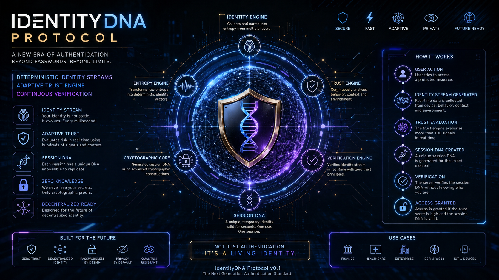

  

# IdentityDNA Protocol

**A Next-Generation Identity Authentication Protocol Based on Deterministic Identity Streams.**

> IDP 0.1 Alpha — Research Draft

---

## 1. Introduction

Traditional authentication asks a single, static question:

> *"Do you know the password?"*

IdentityDNA Protocol asks something fundamentally different:

> *"Can you continuously prove that you are the legitimate participant in this session?"*

IdentityDNA Protocol (IDP) is a research-driven authentication framework that introduces **deterministic identity streams**, **adaptive trust evaluation**, and **cryptographic session identities** as an alternative model for modern authentication systems. It is not a drop-in replacement for passwords — it is a proposal for a different authentication paradigm: continuous, contextual, and cryptographically verifiable identity.

## 2. Vision

Static credentials — passwords, tokens, even most forms of MFA — authenticate a *moment*, not a *session*. Once verified, the system typically assumes the same actor remains behind the keyboard until logout or timeout. IdentityDNA Protocol treats identity as a **stream**, not a snapshot: continuously evaluated, cryptographically bound to the session, and adaptive to context and risk.

## 3. Why IdentityDNA?

- **Beyond static credentials** — identity is evaluated continuously, not just at login.
- **Adaptive trust** — a trust engine scores risk in real time using contextual and behavioral signals.
- **Session DNA** — every session receives a unique, ephemeral cryptographic identity, valid only for that session.
- **Zero-knowledge oriented** — the protocol is designed so verifiers can confirm validity without learning the underlying secret.
- **Decentralization-ready** — designed with future decentralized identity models in mind.

## 4. Architecture

IdentityDNA Protocol is composed of six cooperating engines:

| Component | Responsibility |
|---|---|
| **Identity Engine** | Collects and normalizes entropy from multiple layers (device, behavior, context, environment). |
| **Entropy Engine** | Transforms raw entropy into deterministic identity vectors. |
| **Trust Engine** | Continuously evaluates behavior, context, and environment to produce a trust score. |
| **Cryptographic Core** | Generates the Session DNA using cryptographic constructions. |
| **Verification Engine** | Verifies the identity stream in real time under zero-trust principles. |
| **Session Engine** | Manages the lifecycle of the ephemeral Session DNA. |

See [`docs/architecture/overview.md`](docs/architecture/overview.md) for the full breakdown.

## 5. How it Works

1. **User Action** — the user attempts to access a protected resource.
2. **Identity Stream Generated** — real-time data is collected from device, behavior, context, and environment.
3. **Trust Evaluation** — the trust engine evaluates a wide range of signals in real time.
4. **Session DNA Created** — a unique session DNA is generated for that exact moment, valid once, for one session only.
5. **Verification** — the server verifies the session DNA without learning who the user is.
6. **Access Granted** — access is granted if the trust score is sufficient and the session DNA is valid.

## 6. Identity Stream

An **Identity Stream** is a continuous, deterministic sequence derived from multiple entropy sources tied to a session. Unlike a static credential, it evolves over the lifetime of the session. See [`docs/protocol/identity-stream.md`](docs/protocol/identity-stream.md).

## 7. Session DNA

Each session is bound to a **Session DNA** — a unique, temporary identity valid for a short window, used once, for one session. It cannot be replayed or reused across sessions. See [`docs/protocol/session-dna.md`](docs/protocol/session-dna.md).

## 8. Trust Engine

The trust engine continuously analyzes behavioral, contextual, and environmental signals to produce an adaptive trust score, which determines whether a session remains authenticated. See [`docs/protocol/trust-engine.md`](docs/protocol/trust-engine.md).

## 9. Roadmap

See [`ROADMAP.md`](ROADMAP.md) for the eight-phase development plan, from protocol specification through independent security audit.

## 10. Examples

Reference usage scenarios live under [`examples/`](examples/): basic login, GitHub-style OAuth integration, banking, healthcare, IoT, and zero-trust environments.

## 11. Benchmarks

Performance and stress-testing methodology and results will be published under [`tests/performance/`](tests/performance/) as the reference implementation matures.

## 12. Research

The formal specification and academic whitepaper are being developed under [`docs/whitepaper/`](docs/whitepaper/) and [`docs/research/`](docs/research/).

## 13. Status

This project is in **early research (Alpha) stage**. The protocol is a proposal, not a finished, audited standard. See [`SECURITY.md`](SECURITY.md) for the threat model and known limitations, and [`DISCLAIMER.md`](DISCLAIMER.md) before using any part of this work in production.

## 14. License

The protocol specification and this repository are governed by [`LICENSE.md`](LICENSE.md). Please read it before using, forking, or redistributing any part of this work.

## 15. Author

Created and maintained by **Ciprian Ștefan Pleșca**. See [`AUTHOR.md`](AUTHOR.md).

## 16. Support the Project

If you'd like to support ongoing research and development, see [`DONATIONS.md`](DONATIONS.md).

---

*IdentityDNA Protocol is a proposal for a new model of continuous authentication, built on deterministic session identities and adaptive trust evaluation. It is ambitious, technically grounded, and intentionally left room to evolve.*
