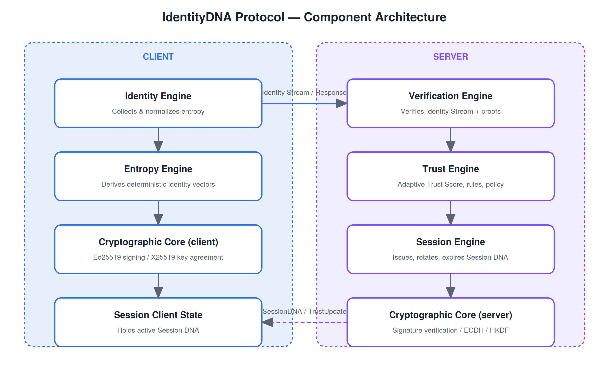
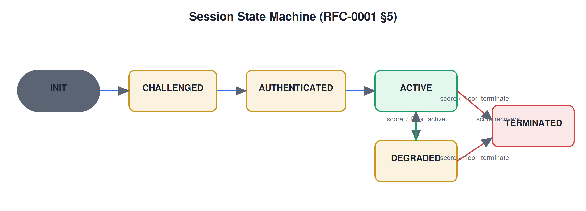
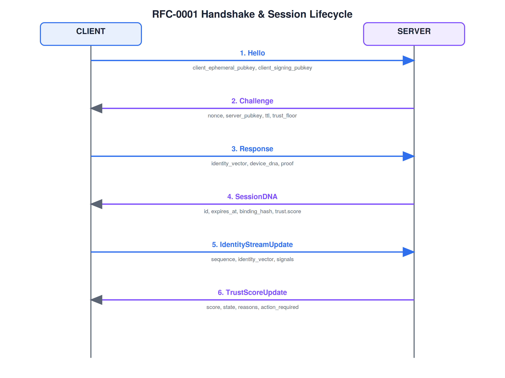
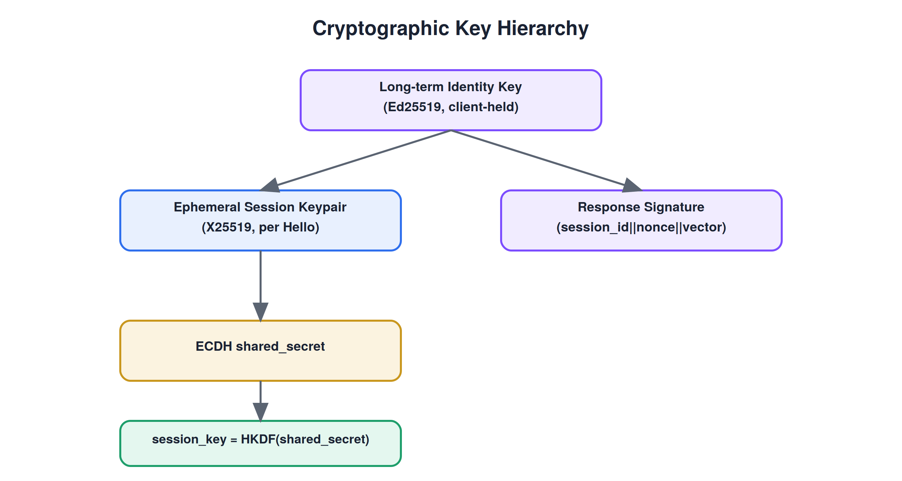
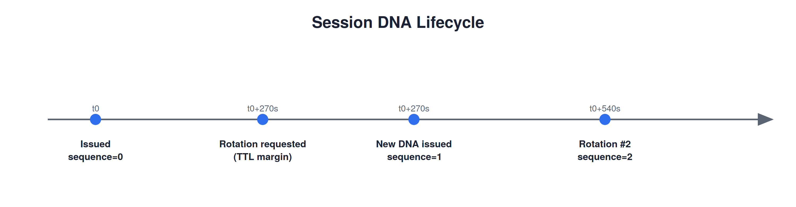
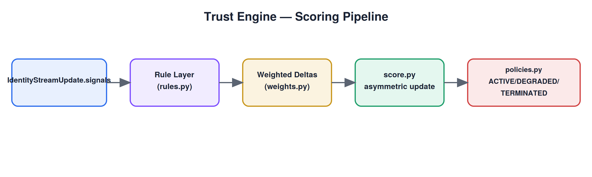
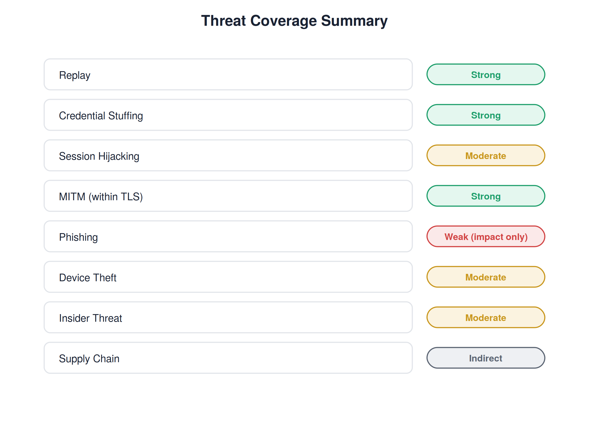

<a id="identitydna-protocol"></a>

# IdentityDNA Protocol

<a id="a-next-generation-identity-authentication-protocol-based-on-deterministic-identity-streams"></a>

## A Next-Generation Identity Authentication Protocol Based on Deterministic Identity Streams

**Author:** Ciprian Ștefan Pleșca

**Status:** Research Whitepaper — Protocol Draft v0.1 / RFC-0001 v1.0

**Organization:** IdentityDNA

**Copyright:** © Ciprian Ștefan Pleșca. All rights reserved. See LICENSE.md for terms governing specification and implementation use.

---

<a id="abstract"></a>

# Abstract

Authentication systems in wide deployment today share a structural weakness: they verify identity at a single point in time — typically at login — and then implicitly extend that trust to the remainder of a session, regardless of what happens afterward. A stolen session token, a hijacked browser tab, or a compromised endpoint can all silently inherit the trust granted at the start of a session, because nothing in the conventional model asks the question again. This weakness is not theoretical. A substantial share of real-world account compromise happens after successful authentication, through session hijacking, token theft, or device compromise, rather than through defeating the login step itself.

This paper presents IdentityDNA Protocol (IDP), a research proposal for continuous, adaptive authentication built on three cooperating ideas. First, a deterministic **Identity Stream**: a continuously updated, cryptographically derived sequence of identity vectors, computed from device, behavioral, and contextual entropy available to the client at each point in a session. Second, an adaptive **Trust Engine**: a server-side scoring system that evaluates the Identity Stream in real time, producing a Trust Score that reflects the system's current confidence that the session remains controlled by its legitimate participant. Third, an ephemeral, cryptographically bound **Session DNA**: a short-lived identity artifact issued for a single session, rotated periodically, and never reusable outside the context it was created for.

We describe the protocol's normative message flow (RFC-0001), its cryptographic foundations — built exclusively on well-established, independently reviewed primitives rather than novel cryptography — its threat model, and a reference implementation that demonstrates the full handshake and session lifecycle executing correctly end to end. We are explicit about what remains open: the trust-scoring model is currently heuristic rather than formally validated, no independent security audit has been performed, and several components described in the architecture are not yet implemented across all target platforms. IdentityDNA Protocol is presented as a research proposal and an invitation for scrutiny, not as a finished or audited standard, and not as a claim that any authentication system can be made unbreakable.

---

<a id="executive-summary"></a>

# Executive Summary

Most authentication systems check identity once, at login, and then trust a session for its entire lifetime. IdentityDNA Protocol (IDP) instead checks continuously, by deriving a fresh, cryptographically grounded identity signal throughout a session (the **Identity Stream**), scoring it in real time against contextual and behavioral expectations (the **Trust Engine**), and binding session validity to a short-lived, rotating credential (**Session DNA**) rather than a static, long-lived token.

The protocol is specified normatively in RFC-0001, reproduced in full in Appendix F. Its cryptographic layer uses only well-established primitives — Ed25519, X25519, HKDF-SHA256, Argon2id, ChaCha20-Poly1305, and BLAKE3/SHA-256 — combined but not reinvented (Section 11). A working reference implementation (Section 18) demonstrates the complete handshake and a multi-step session lifecycle executing correctly, including a worked example in which an anomalous update correctly triggers a degraded trust state and a step-up verification requirement (Section 8.6, Section 13.6).

This paper is equally direct about what is not yet resolved. The Trust Engine's specific scoring weights are illustrative defaults, not empirically validated (Section 13.3, Section 20). No formal cryptographic proof of the protocol's composed security properties yet exists (Section 15). No independent security audit has been performed (Section 14.4). The protocol explicitly does not solve phishing or defend against a fully compromised endpoint (Section 14.2–14.3). Readers evaluating IdentityDNA Protocol for any real use should treat this whitepaper as a rigorous research proposal — one whose cryptographic foundations are sound and whose reference implementation genuinely works as described — rather than as evidence of production readiness.

---

<a id="list-of-figures"></a>

# List of Figures

Figure 1. IdentityDNA Protocol component architecture. — Section 6

Figure 2. The session state machine. — Section 7

Figure 3. The full RFC-0001 message flow. — Section 8

Figure 4. Cryptographic key hierarchy. — Section 11

Figure 5. Session DNA lifecycle across multiple rotations. — Section 12

Figure 6. The Trust Engine's scoring pipeline. — Section 13

Figure 7. Threat coverage summary. — Section 14

<a id="list-of-tables"></a>

# List of Tables

Table 1. Session states and entry conditions. — Section 7

Table 2. Entropy categories and their contribution to the Identity Stream. — Section 10

Table 3. Cryptographic primitive selection and requirement level. — Section 11

Table 4. Trust Engine default rule weights. — Section 13

Table 5. STRIDE category mapping. — Section 14

Table 6. Comparison with existing authentication approaches. — Section 19

Table 7. Normative error codes. — Appendix B

Table 8. Glossary of terms. — Appendix C

---

## Table of Contents

- [Abstract](#abstract)
- [Executive Summary](#executive-summary)
- [List of Figures](#list-of-figures)
- [List of Tables](#list-of-tables)
- [1. Introduction](#1-introduction)
- [2. Motivation](#2-motivation)
- [3. Background and Related Work](#3-background-and-related-work)
- [4. Problem Statement](#4-problem-statement)
- [5. The IdentityDNA Concept](#5-the-identitydna-concept)
- [6. System Architecture](#6-system-architecture)
- [7. Protocol State Machine](#7-protocol-state-machine)
- [8. The Handshake Protocol](#8-the-handshake-protocol)
- [9. Identity Streams and the Identity Vector](#9-identity-streams-and-the-identity-vector)
- [10. Entropy Sources and Device DNA](#10-entropy-sources-and-device-dna)
- [11. Cryptographic Foundations](#11-cryptographic-foundations)
- [12. Session DNA](#12-session-dna)
- [13. The Trust Engine](#13-the-trust-engine)
- [14. Threat Model and Security Analysis](#14-threat-model-and-security-analysis)
- [15. Toward a Formal Mathematical Model](#15-toward-a-formal-mathematical-model)
- [16. Privacy and Ethical Considerations](#16-privacy-and-ethical-considerations)
- [17. Performance Considerations](#17-performance-considerations)
- [18. Reference Implementation](#18-reference-implementation)
- [19. Comparison with Existing Approaches](#19-comparison-with-existing-approaches)
- [20. Limitations](#20-limitations)
- [21. Future Work](#21-future-work)
- [22. Conclusion](#22-conclusion)
- [23. Community, Governance, and Contribution](#23-community-governance-and-contribution)
- [24. Reproducibility Statement](#24-reproducibility-statement)
- [References](#references)
- [Appendix A — Normative Message Schemas](#appendix-a-normative-message-schemas)
- [Appendix B — Normative Error Codes](#appendix-b-normative-error-codes)
- [Appendix C — Glossary](#appendix-c-glossary)
- [Appendix D — Repository Map](#appendix-d-repository-map)
- [Appendix E — Deployment Case Studies](#appendix-e-deployment-case-studies)
- [Appendix F — RFC-0001 Full Text](#appendix-f-rfc-0001-full-text)
- [Appendix G — CLI and API Command Reference](#appendix-g-cli-and-api-command-reference)
- [Appendix H — Frequently Asked Questions](#appendix-h-frequently-asked-questions)
- [Appendix I — Notation Summary](#appendix-i-notation-summary)
- [Appendix J — Design Decisions Log](#appendix-j-design-decisions-log)
- [Appendix K — Sample Deployment Configurations](#appendix-k-sample-deployment-configurations)
- [Appendix L — Cryptographic Test Vectors](#appendix-l-cryptographic-test-vectors)
- [Appendix M — Extended Adversarial Scenarios](#appendix-m-extended-adversarial-scenarios)
- [Appendix N — Regulatory Considerations (Non-Legal Guidance)](#appendix-n-regulatory-considerations-non-legal-guidance)
- [Appendix O — Index of Normative Requirements](#appendix-o-index-of-normative-requirements)
- [Appendix P — Client and Server Pseudocode Reference](#appendix-p-client-and-server-pseudocode-reference)
- [Appendix Q — Migration Guide from Static Session Models](#appendix-q-migration-guide-from-static-session-models)
- [Colophon](#colophon)

---

<a id="1-introduction"></a>

# 1. Introduction

Every authentication system answers a version of the same question: is the party currently interacting with this system the party it claims to be? For most of the history of networked computing, the answer has been produced once, at a single checkpoint, and then trusted for as long as a session token remains technically valid. A user supplies a password, perhaps a second factor, and is granted a session; from that moment forward, the system generally assumes — absent an explicit logout or timeout — that whoever is issuing requests under that session is still the person who logged in.

This assumption is convenient, and it is also frequently wrong. Sessions are hijacked through stolen cookies and tokens. Browsers are compromised by malicious extensions that ride along on an already-authenticated tab. Devices are left unlocked, stolen, or borrowed. Long-lived API tokens leak into logs, repositories, and third-party integrations. In each of these cases, the authentication system's original judgment — correct at the moment it was made — becomes stale, and nothing in the conventional model prompts it to reconsider.

IdentityDNA Protocol (IDP) is a proposal to close this gap by treating identity not as a fact established once, but as a stream: a sequence of cryptographically grounded observations, continuously produced and continuously evaluated for the duration of a session. This document is the whitepaper accompanying the protocol's normative specification (RFC-0001) and its reference implementation. It exists to explain not just what IdentityDNA Protocol does, but why it is built the way it is, what it assumes, what it deliberately does not attempt to solve, and what remains to be proven before it could reasonably be trusted in a high-stakes production environment.

The remainder of this paper is organized as follows. Sections 2 through 4 motivate the problem and situate it relative to prior work. Section 5 introduces the IdentityDNA concept at a high level. Sections 6 through 13 describe the protocol's architecture, state machine, handshake, identity streams, entropy sources, cryptographic foundations, session identity model, and trust engine in detail, with reference to the accompanying implementation. Section 14 presents the threat model and security analysis. Section 15 develops a more formal mathematical treatment of the protocol's core functions. Sections 16 through 18 address privacy, performance, and the reference implementation itself. Section 19 compares IdentityDNA Protocol to existing standards. Sections 20 and 21 discuss limitations and future work candidly, and Section 22 concludes. Appendices reproduce the full normative message schemas, error codes, and a glossary for reference.

<a id="2-motivation"></a>

# 2. Motivation

<a id="21-the-single-checkpoint-problem"></a>

## 2.1 The Single-Checkpoint Problem

Static credential models — passwords, long-lived bearer tokens, and most deployments of multi-factor authentication (MFA) — share a common shape: a burst of verification effort at the start of a session, followed by an extended period of implicit trust. The security industry has spent considerable effort strengthening the first part of that shape — better password hashing, hardware security keys, risk-based step-up challenges at login — while the second part, the long tail of an active session, has received comparatively little structural attention.

This asymmetry matters because the cost of defeating authentication is not fixed; it shifts to wherever the weakest link is. As login-time defenses improve, attackers rationally shift toward the parts of the system that are least scrutinized: the session itself. Cross-site scripting attacks that exfiltrate a session cookie, malware that reads a stored bearer token, or simple session-fixation attacks all share the property that they do not need to defeat the login mechanism at all — they only need to acquire or ride along on a session that has already been authenticated.

<a id="22-continuous-authentication-as-a-response"></a>

## 2.2 Continuous Authentication as a Response

The idea that authentication should not stop at login is not new; it appears under various names in the literature and in industry practice — continuous authentication, active authentication, risk-based authentication, and adaptive access control. What has been comparatively rare is a single, openly specified protocol that unifies three things that are usually addressed separately: (a) a well-defined method for deriving a continuously updated identity signal from available entropy, (b) an explicit, inspectable trust-scoring model that consumes that signal, and (c) a session identity primitive that is itself ephemeral and cryptographically bound to the evaluation process, rather than a static token that, once issued, is trusted until it expires regardless of what the trust engine concludes in the meantime.

IdentityDNA Protocol's motivation is to specify this combination precisely enough that independent implementations could interoperate, and openly enough that its assumptions and weaknesses can be examined by people who did not write it. This second goal shapes many of the design choices described later in this paper: preferring well-reviewed cryptographic primitives over novel constructions, publishing the trust-scoring model's structure even though its specific weights are acknowledged to be unvalidated, and stating plainly, in the threat model, which classes of attack the protocol does not claim to address.

<a id="23-why-not-simply-shorten-session-lifetimes"></a>

## 2.3 Why Not Simply Shorten Session Lifetimes?

A natural objection is that many of these problems can be mitigated simply by shortening token lifetimes and re-authenticating more frequently. This is true as far as it goes, but it trades one cost for another: usability. Forcing frequent re-authentication degrades the user experience and, in practice, often pushes users and developers toward workarounds — storing credentials insecurely, disabling timeouts, or granting broader token scopes to reduce how often re-authentication is needed — that can leave the system worse off than before. Continuous, adaptive authentication aims to decouple session length from security: a session can remain long-lived in the common case, while still being re-evaluated constantly in the background, so that friction is introduced only when the Trust Engine's confidence actually drops, rather than on a fixed and arbitrary schedule.

<a id="3-background-and-related-work"></a>

# 3. Background and Related Work

IdentityDNA Protocol does not emerge in a vacuum. It draws on, and should be read alongside, several established areas of authentication research and practice. This section situates the protocol relative to each, with the aim of being precise about what IDP borrows, what it combines differently, and where existing standards already solve a problem well enough that IDP simply relies on them rather than attempting to replace them.

<a id="31-password-and-token-based-authentication"></a>

## 3.1 Password and Token-Based Authentication

The dominant model in production systems remains a password (or passkey) exchanged once at login, producing a bearer token — a session cookie, a JWT, an OAuth access token — that is then trusted for its stated lifetime. This model is simple, well understood, and supported by mature tooling. Its weakness, discussed in Section 2, is that the token itself becomes the entire basis of trust for its lifetime: anyone who possesses it is treated as the legitimate party, regardless of behavioral or contextual change. IdentityDNA Protocol does not replace the initial proof-of-possession step found in these systems (the `Response` message in RFC-0001 plays an analogous role) but extends it into a continuous process rather than treating it as a one-time event.

<a id="32-multi-factor-and-passwordless-authentication-fido2webauthn"></a>

## 3.2 Multi-Factor and Passwordless Authentication (FIDO2/WebAuthn)

FIDO2 and WebAuthn represent a significant improvement over passwords: they replace a shared secret with public-key cryptography and hardware-backed key storage, and they are resistant to phishing in ways passwords are not, because the credential is cryptographically bound to the origin that requested it. IdentityDNA Protocol's proof mechanism (Ed25519 signatures over a challenge nonce) is philosophically aligned with this approach and could, in a production deployment, be composed with WebAuthn rather than an independent key-management scheme — RFC-0001 does not mandate where the client's long-term signing key originates, only how it is used within the protocol. What FIDO2/WebAuthn does not natively provide is continuous, post-login evaluation: once the ceremony completes, the resulting session is trusted exactly as in the password model. This is precisely the gap IDP is designed to fill, and the two are complementary rather than competing.

<a id="33-risk-based-and-adaptive-authentication"></a>

## 3.3 Risk-Based and Adaptive Authentication

A substantial body of industry practice exists under the banner of risk-based or adaptive authentication: systems that compute a risk score at login time (or periodically thereafter) from signals such as IP reputation, device fingerprint consistency, and geolocation, and use that score to decide whether to grant access outright, request a step-up challenge, or deny access. IdentityDNA Protocol's Trust Engine is a direct descendant of this line of work. What IDP attempts to add is specification: rather than each vendor implementing an opaque, proprietary risk model, RFC-0001 defines the message shapes, state transitions, and general scoring inputs precisely enough that the approach could be implemented interoperably and inspected by third parties, even though the specific weights (`reference/trust-engine/weights.py`) remain a deployment-tunable, and explicitly unvalidated, detail.

<a id="34-behavioral-biometrics"></a>

## 3.4 Behavioral Biometrics

Behavioral biometrics research studies how typing cadence, pointer movement, gait (on mobile devices), and other interaction patterns can serve as a continuous, largely passive identity signal. This literature directly informs IDP's `behavioral_delta` signal within the Identity Stream (Section 9), though the reference implementation's behavioral model is intentionally minimal — a placeholder for a more rigorous statistical baseline-and-deviation model that a production deployment would need to develop and validate, rather than a claim that the reference implementation's current cadence-delta heuristic is adequate on its own.

<a id="35-zero-trust-network-access-ztna"></a>

## 3.5 Zero-Trust Network Access (ZTNA)

Zero-trust architectures reject the notion of a trusted network perimeter and instead require every request to be authenticated and authorized on its own merits. IdentityDNA Protocol shares this philosophy at the session level: the Verification Engine (`docs/protocol/verification.md`) is explicitly described as operating under zero-trust principles, treating each `IdentityStreamUpdate` as an opportunity to re-confirm — rather than passively assume — that the session remains legitimate. IDP can be understood as bringing a zero-trust posture inward, to the lifetime of an individual session, rather than only outward, to network segmentation.

<a id="36-decentralized-identity-and-verifiable-credentials"></a>

## 3.6 Decentralized Identity and Verifiable Credentials

Emerging decentralized identity standards (DIDs, verifiable credentials) aim to give individuals portable, self-sovereign control over their identity claims, independent of any single issuing authority. IdentityDNA Protocol does not currently implement DID compatibility, but the architecture — a client-held long-term signing key, used to produce proofs verified by a relying party — is structurally compatible with future integration, and this is listed explicitly as future work in Section 21.

<a id="37-summary-of-positioning"></a>

## 3.7 Summary of Positioning

IdentityDNA Protocol's contribution is not any single one of the ideas above in isolation — deterministic derivation of identity signals, adaptive trust scoring, and ephemeral session identity all have independent precedent. The contribution, to the extent this research proposal succeeds, is in specifying their composition normatively: a single state machine, a single set of message schemas, and a single, explicit set of cryptographic and security assumptions that ties them together into one interoperable protocol, rather than leaving each vendor to reinvent the combination independently and opaquely.

<a id="38-a-note-on-terminology-across-the-literature"></a>

## 3.8 A Note on Terminology Across the Literature

Readers coming from different subfields will recognize overlapping vocabulary used inconsistently across the literature surveyed above. "Continuous authentication" in the behavioral-biometrics community (Section 3.4) often refers narrowly to passive, biometric re-verification, while the same phrase in enterprise identity-and-access-management contexts (Section 3.3) often refers to periodic, active risk reassessment. "Zero trust" is sometimes used to describe an entire network architecture (Section 3.5) and sometimes used loosely as a marketing term for any product that re-checks access more than once. This paper uses each term as defined at first use in this section, and asks readers translating IdentityDNA Protocol's ideas into their own subfield's vocabulary to anchor on the precise mechanisms described in Sections 6 through 15 — the Identity Stream, Trust Engine, and Session DNA — rather than on any single borrowed label, since the label alone does not disambiguate which specific mechanism is meant.

<a id="4-problem-statement"></a>

# 4. Problem Statement

We can now state the problem this work addresses precisely. Given a session between a client and a server, established through some initial proof of identity, we want a mechanism that satisfies the following four properties simultaneously.

1. Continuous re-evaluation. The system should continuously produce evidence, throughout the session, that the current participant is the same one who was authenticated at the session's start — not only at login.
2. Bounded exposure. The cryptographic artifact identifying an active session (its Session DNA) should have a short, bounded lifetime, and should not be reusable outside the session or context for which it was issued, to limit the value of any single captured artifact.
3. Minimal disclosure. The mechanism should allow the verifying party to confirm the validity and continuity of a session without needing to learn, store, or be able to reconstruct the client's raw, potentially sensitive device and behavioral data.
4. Graceful degradation. Loss of confidence should not be a binary, all-or-nothing event. The system should be able to express intermediate states — reduced trust, a requirement for step-up verification — rather than only 'authenticated' or 'logged out.'

No single existing, widely deployed standard specifies a solution satisfying all four properties together as a normative, implementable protocol; each of the related approaches surveyed in Section 3 addresses a subset. IdentityDNA Protocol's specific claim is to specify a composition that addresses all four, while being explicit — in Section 14 and Section 20 — about which parts of that composition are already reasonably well-founded (largely, the cryptographic mechanics) and which remain open research questions requiring further validation (largely, the specific trust-scoring weights and their behavior under adversarial conditions).

It is worth stating explicitly what is *not* part of this problem statement. IdentityDNA Protocol does not attempt to solve delegated authorization (who is permitted to act on whose behalf, and with what scope) — that remains OAuth 2.0's domain, as discussed in Section 19.1. It does not attempt to solve initial identity proofing (verifying that a real-world individual corresponds to a claimed digital identity at account-creation time) — that is a separate problem, typically addressed through know-your-customer processes, document verification, or federated identity providers, entirely outside RFC-0001's scope. And it does not attempt to solve authorization policy (what a given trust level or role is permitted to do) — RFC-0001's Trust Score and state are inputs to such a policy, not the policy itself. Scoping the problem this narrowly is deliberate: a protocol that tried to solve all of authentication, authorization, and identity proofing simultaneously would be harder to specify precisely, harder to compose with existing standards, and harder for this paper to make honest claims about.

<a id="5-the-identitydna-concept"></a>

# 5. The IdentityDNA Concept

Traditional authentication asks a single question, once: **Do you know the password?** IdentityDNA Protocol asks a different, standing question, continuously: **Can you continuously prove that you are the legitimate participant in this session?**

This reframing has three structural consequences, each of which corresponds to one of the protocol's three core primitives.

<a id="51-identity-as-a-stream-not-a-snapshot"></a>

## 5.1 Identity as a Stream, Not a Snapshot

Rather than producing a single identity assertion at login, the client continuously derives new **Identity Vectors** — 32-byte deterministic digests computed from available entropy — over the life of the session. Collectively, these form the **Identity Stream**. Because each vector is derived through a one-way function (Section 9), the server never needs to, and by design must not, reconstruct the client's raw entropy from the stream; it only needs to confirm that each new vector is consistent with what a legitimate, continuing session should produce.

<a id="52-trust-as-a-score-not-a-boolean"></a>

## 5.2 Trust as a Score, Not a Boolean

The server's **Trust Engine** consumes the Identity Stream, alongside contextual signals, and maintains a continuously updated **Trust Score** in the range [0, 100]. Because this is a score rather than a boolean, the protocol can express intermediate confidence levels and react proportionately — for instance, requiring step-up verification for a sensitive action once the score drops below an operational threshold, without immediately terminating a session over a single ambiguous signal.

<a id="53-session-identity-as-ephemeral-not-static"></a>

## 5.3 Session Identity as Ephemeral, Not Static

The cryptographic artifact identifying an active session — the **Session DNA** — is deliberately short-lived and is rotated periodically over the life of a long-running session (Section 12). Unlike a conventional bearer token, whose validity is fixed at issuance and does not reflect anything that happens afterward, Session DNA validity is bound, through the Trust Engine, to the ongoing evaluation of the Identity Stream: a session that degrades in trust moves toward a `DEGRADED` or `TERMINATED` state (Section 7) regardless of how much time remains on the underlying token's nominal expiry.

Together, these three primitives are intended to convert authentication from a single act into a standing, cryptographically anchored relationship between client and server — one that can be examined, and found wanting, at any point over the session's lifetime, rather than only at its beginning.

<a id="54-an-illustrative-narrative"></a>

## 5.4 An Illustrative Narrative

The preceding subsections describe the concept mechanically. It may help to walk through it narratively as well, following a single fictional user through a session, before the paper turns to formal specification in Section 6 onward.

Alice opens her banking application on a weekday morning, from the same laptop and home network she has used for months. Her client generates a fresh ephemeral key pair and sends `Hello`; the bank's server responds with a `Challenge`. Alice's device signs the challenge together with a freshly derived Identity Vector — built from her laptop's coarse hardware profile, her home network's bucketed identity, and a baseline behavioral snapshot — and the server, finding the signature valid and the initial Trust Score comfortably above the required floor, issues a Session DNA. Alice is in.

For the next twenty minutes, as Alice checks her balance and pays a bill, her client periodically emits `IdentityStreamUpdate` messages. Her typing cadence and pointer movement are unremarkable; her network hasn't changed. Each `TrustScoreUpdate` comes back close to her session's starting score, and her Session DNA quietly rotates once, well before its five-minute window expires, without Alice noticing anything at all.

Now suppose, instead, that midway through this session, Alice's laptop is picked up by someone else — a coworker glancing at an unlocked screen, say — who begins clicking around with a noticeably different interaction pattern, on the same network. The next `IdentityStreamUpdate` reflects that shift: a moderate behavioral delta, no network anomaly. The Trust Score dips, but not sharply — this alone is not damning, and the session remains `ACTIVE`. If the new user then attempts to initiate a wire transfer — a sensitive action the deploying bank has configured to require a higher trust floor than ordinary balance checks — the policy layer requests step-up verification before allowing it, even though the underlying Session DNA remains technically unexpired. Alice, returning to her laptop, would need to complete that step-up herself; the coworker, lacking her long-term signing key, cannot.

Compare this to the same scenario under a conventional session-cookie model: the coworker's clicks would have been indistinguishable, to the server, from Alice's own, for as long as the cookie remained valid — commonly hours. The difference between the two outcomes is not that IdentityDNA Protocol makes the coworker's access impossible; a careless coworker who never attempts a sensitive action would go entirely unnoticed under either model. The difference is that IDP creates a mechanism capable of noticing and reacting to a change in who is present, precisely at the moment that change becomes consequential — which is the concrete, human-scale version of the structural argument made abstractly in Sections 2 and 4.

<a id="6-system-architecture"></a>

# 6. System Architecture

IdentityDNA Protocol is implemented as six cooperating components, split across the client and the server, each with a narrow, well-defined responsibility. This separation is deliberate: it allows each component to be reasoned about, tested, and — in the reference implementation — replaced independently, and it keeps the cryptographic surface area (the Cryptographic Core) isolated from business logic (the Trust Engine's rules and policies).



*Figure 1. IdentityDNA Protocol component architecture. Client-side components collect and derive identity signals; server-side components verify, score, and manage session identity.*

<a id="61-client-side-components"></a>

## 6.1 Client-Side Components

The **Identity Engine** is responsible for collecting and normalizing entropy from whatever sources are available on the client's platform — device characteristics, behavioral signals, contextual data — and for orchestrating the handshake (`reference/identity-engine/session_builder.py`). The **Entropy Engine** is responsible for the deterministic transformation of that raw entropy into an Identity Vector suitable for transmission (`reference/identity-engine/identity_vector.py`), a process detailed in Section 9. The client's **Cryptographic Core** holds the client's Ed25519 signing key and X25519 ephemeral key pair, and performs all client-side signing and key-agreement operations (`reference/crypto/primitives.py`).

<a id="62-server-side-components"></a>

## 6.2 Server-Side Components

The **Verification Engine** validates incoming `Response` and `IdentityStreamUpdate` messages against the session's cryptographic and sequencing state (`reference/identity-engine/verification.py`, `reference/session-engine/validator.py`). The **Trust Engine** consumes validated signals and produces the session's Trust Score, applying a configurable rule and weighting layer (`reference/trust-engine/`). The **Session Engine** is responsible for issuing, rotating, and expiring Session DNA (`reference/session-engine/`). The server's **Cryptographic Core** mirrors the client's — signature verification, ECDH key agreement, and HKDF-based key derivation — using the same small, audited set of primitives described in Section 11.

<a id="63-data-flow"></a>

## 6.3 Data Flow

In steady state, data flows in two directions along the same axis: the client periodically emits `IdentityStreamUpdate` messages carrying a new Identity Vector and behavioral/contextual signals; the server periodically responds with `TrustScoreUpdate` messages carrying the current score, state, and — where relevant — a required action. This is intentionally symmetric with, and reuses the same cryptographic session key established during, the initial handshake described in Section 8.

<a id="64-deployment-topologies"></a>

## 6.4 Deployment Topologies

RFC-0001 specifies the message protocol but deliberately leaves deployment topology unspecified, since the correct choice depends heavily on scale and operational context. Three topologies are worth distinguishing explicitly, because each has different implications for the state that must be tracked (Section 9.2, Section 12).

In a **single-instance deployment**, the Verifier (Section 18.2) holds all session state — consumed nonces, last-seen sequence numbers, active Session DNA — in a single process's memory, exactly as the reference implementation does. This is the simplest topology and is adequate for development, testing, and low-scale production use, but does not survive a process restart and does not horizontally scale.

In a **shared-state deployment**, multiple server instances sit behind a load balancer, with session state (nonce consumption, sequence tracking, Trust Score history) externalized to a shared store — a distributed cache or database — so that any instance can correctly validate any session's next message regardless of which instance handled the previous one. This is the topology a real production deployment of IdentityDNA Protocol would need, and it introduces a genuine engineering requirement not addressed by the reference implementation: the nonce-consumption and sequence-validation checks in `reference/session-engine/validator.py` must become atomic, race-free operations against that shared store, or an attacker could exploit a race window to replay a message across two instances that have not yet synchronized.

In a **sharded-by-session deployment**, a consistent-hashing layer routes all traffic for a given `session_id` to the same server instance for the session's lifetime, avoiding the need for a shared store at the cost of more complex routing infrastructure and more disruptive failover (a lost instance loses every session pinned to it, unless session state is also replicated). We do not recommend one topology over another in this paper; we note the tradeoff so that implementers evaluating the reference implementation understand precisely which parts of it — namely, its in-memory `Verifier.sessions` dictionary — would need to be redesigned, not merely deployed as-is, for a horizontally scaled production system.

<a id="7-protocol-state-machine"></a>

# 7. Protocol State Machine

RFC-0001 §5 defines a strict state machine that governs every session, from the server's point of view. Precisely defining these states — and the conditions under which a session transitions between them — is what allows IdentityDNA Protocol to express graceful degradation (Section 4, Property 4) rather than a binary authenticated/unauthenticated model.



*Figure 2. The session state machine. A session may cycle between ACTIVE and DEGRADED as the Trust Score fluctuates, but transitions to TERMINATED are one-way.*

| State | Meaning | Entered when |
| --- | --- | --- |
| INIT | Client has sent Hello; no challenge issued yet. | Session object created by the server. |
| CHALLENGED | Server has issued a Challenge; awaiting Response. | Hello successfully parsed and a nonce/challenge generated. |
| AUTHENTICATED | Initial Response verified; about to issue Session DNA. | Proof signature and initial Trust Score checks pass. |
| ACTIVE | Session DNA issued; Trust Score at or above the active floor. | Immediately following AUTHENTICATED, or after DEGRADED recovers. |
| DEGRADED | Trust Score below the active floor but above the terminate floor. | An IdentityStreamUpdate drives the score below floor_active. |
| TERMINATED | Session DNA invalid; all further requests rejected. | Score drops below floor_terminate, or explicit termination (logout, DELETE). |

Two properties of this state machine are worth highlighting. First, the transition from `ACTIVE` to `DEGRADED` is reversible — a session that dips below the active floor due to a transient signal (an unusual but ultimately benign network change, for instance) can recover as subsequent updates restore the score, without requiring the user to fully re-authenticate. Second, the transition into `TERMINATED` is strictly one-way: once a session is terminated, RFC-0001 requires the server to reject all further requests against that `session_id` with `E-SESSION-TERMINATED` (Appendix B), and a new session must be established from `Hello` onward. This asymmetry is intentional — recovery from mild suspicion should be cheap; recovery from a serious trust failure should require restarting the trust-establishment process from scratch.

<a id="8-the-handshake-protocol"></a>

# 8. The Handshake Protocol

The handshake establishes a session and produces the first Session DNA. It is deliberately modeled on the structure of well-understood handshake protocols such as TLS: an initial hello exposing supported capabilities, a server-issued single-use challenge, a client response carrying proof of possession of a private key, and a server-issued credential (here, Session DNA) upon success.



*Figure 3. The full RFC-0001 message flow, from session initiation through the first identity-stream evaluation cycle.*

<a id="81-step-1-hello"></a>

## 8.1 Step 1 — Hello

The client generates a fresh X25519 ephemeral key pair (used only for this session's key agreement) and includes its Ed25519 signing public key (used only to verify proofs). RFC-0001 §6 and Appendix A require these to be transmitted as two distinct fields, `client_ephemeral_pubkey` and `client_signing_pubkey` — an earlier draft of this specification used a single combined field, which was corrected specifically because conflating a key-agreement key with a signing key weakens the security argument for both; the two key types serve different cryptographic purposes and must not be derived from or substituted for one another.

<a id="82-step-2-challenge"></a>

## 8.2 Step 2 — Challenge

The server responds with a session identifier (at least 128 bits of entropy), a single-use nonce, its own X25519 ephemeral public key, a time-to-live for the challenge, and the minimum initial Trust Score (`required_trust_floor`) the client must achieve to proceed. The nonce is consumed exactly once; any attempt to reuse it is rejected with `E-STREAM-REPLAY`.

<a id="83-step-3-response"></a>

## 8.3 Step 3 — Response

The client computes its first Identity Vector (Section 9) and a Device DNA snapshot (Section 10), then signs the concatenation of the session identifier, the challenge nonce, and the Identity Vector using its Ed25519 signing key. This binds the proof to this specific session and this specific challenge, preventing the signature from being replayed against a different session even if the same underlying key were reused.

<a id="84-step-4-sessiondna"></a>

## 8.4 Step 4 — SessionDNA

Upon successful verification, the server derives the session key via X25519 ECDH and HKDF-SHA256 (Section 11), computes an initial Trust Score from the submitted Device DNA and any contextual flags, and — provided that score meets the challenge's required floor — issues the first Session DNA, transitioning the session to `ACTIVE`. If the initial score falls short, the session moves directly to `TERMINATED` and the server returns `E-TRUST-INSUFFICIENT`, rather than issuing a Session DNA that would immediately need to be revoked.

<a id="85-steps-56-the-steady-state-loop"></a>

## 8.5 Steps 5–6 — The Steady-State Loop

Once `ACTIVE`, the client periodically submits `IdentityStreamUpdate` messages; the server responds with `TrustScoreUpdate` messages reflecting the Trust Engine's current evaluation (Section 13). This loop continues for the life of the session, interspersed with Session DNA rotations as needed (Section 12).

<a id="86-worked-example"></a>

## 8.6 Worked Example

The reference implementation's end-to-end demonstration (`reference/verifier/demo.py`) executes this exact sequence against three simulated updates: a near-baseline update, a mildly deviating update, and a sharply anomalous one (a large behavioral-cadence shift combined with reduced network consistency and a `new_ip_range` context flag). In the demonstration run, the Trust Score moves from an initial 100.0, to 94.0 after the first update, to 86.0 after the second, and to 48.0 after the third — at which point the session transitions to `DEGRADED` and the server's response carries `action_required: "step_up"`. This behavior is not hypothetical; it is the actual, reproducible output of the reference implementation described in Section 18, and is included here as a concrete illustration of Sections 9 and 13 working together.

```
TrustScoreUpdate (final step of the worked example):
{
  "trust": {
    "score": 48.0,
    "previous_score": 86.0,
    "state": "DEGRADED",
    "reasons": [
      "behavioral_delta_high",
      "network_inconsistent",
      "context_flag:new_ip_range"
    ]
  },
  "action_required": "step_up"
}
```

<a id="9-identity-streams-and-the-identity-vector"></a>

# 9. Identity Streams and the Identity Vector

The Identity Stream is the central data structure of IdentityDNA Protocol: an ordered sequence of Identity Vectors, one per update, that together constitute the continuously produced evidence of session legitimacy described in Section 5.1.

<a id="91-definition"></a>

## 9.1 Definition

For a session with identifier `session_id` and update sequence number `n`, the Identity Vector is defined as:

```
identity_vector[n] = HKDF-SHA256(
    ikm  = entropy_digest(device_dna || behavioral_signals || context_signals),
    salt = session_id,
    info = "IDP-v1-identity-vector" || n,
    length = 32
)

where entropy_digest(x) = BLAKE3(x)   if BLAKE3 is available,
                          SHA-256(x)  otherwise (mandatory fallback).
```

This construction has three properties that matter for the protocol's security argument. It is **deterministic**: given identical inputs, the same vector is always produced, which allows the server to verify consistency without needing to store the vector itself as a secret. It is **session-bound**, via the HKDF salt: the same underlying entropy produces a different vector in a different session, preventing cross-session correlation of raw device/behavioral signals through the vector alone. And it is (to the best of current cryptographic understanding of HKDF and the underlying hash functions) **one-way**: recovering `device_dna || behavioral_signals || context_signals` from `identity_vector[n]` is not computationally feasible, which is what allows the server to evaluate the stream without ever needing to reconstruct — or store — the client's raw entropy.

<a id="92-sequencing-and-replay-resistance"></a>

## 9.2 Sequencing and Replay Resistance

Each `IdentityStreamUpdate` carries a strictly increasing `sequence` number. The server-side validator (`reference/session-engine/validator.py::validate_sequence`) rejects any update whose sequence number is not greater than the last one accepted for that session — returning `E-STREAM-REPLAY` if the sequence is a repeat, or `E-STREAM-STALE` if it is out of order — which is the mechanism underlying the replay mitigation discussed in Section 14.1.

<a id="93-update-cadence"></a>

## 9.3 Update Cadence

RFC-0001 deliberately does not mandate a fixed update interval; this is left as a deployment-configurable tradeoff between responsiveness (shorter intervals detect anomalies sooner) and overhead (shorter intervals increase message volume and, for behavioral signals in particular, may not have accumulated enough new information to be meaningful). A reasonable operational default, used in the reference implementation's demonstration, treats updates as event-driven — triggered by meaningful user interaction — rather than on a fixed timer, though RFC-0001 leaves this entirely to the implementer.

<a id="94-numerical-illustration"></a>

## 9.4 Numerical Illustration

To ground Section 9.1's derivation in a concrete example, consider a session with `session_id = "sess_yXs3ytQ6_L6xM9d3iZePUW-z"` (an actual identifier produced by the reference implementation's demonstration run, Section 8.6) and `sequence = 0`. The entropy input is the concatenation of the serialized Device DNA signal string, the behavioral-signal byte encoding, and the context-signal byte encoding, exactly as implemented in `reference/identity-engine/identity_vector.py::compute_identity_vector`. Digesting this concatenation with BLAKE3 (or SHA-256, as the mandatory fallback) yields a 32-byte `entropy_digest`. This digest becomes the input keying material to HKDF-SHA256, salted with the UTF-8 bytes of the session identifier and expanded using the domain-separated info string `"IDP-v1-identity-vector" || 0` (the sequence number encoded as an 8-byte big-endian integer, per `reference/crypto/primitives.py::derive_identity_vector`). The output — base64url-encoded for transmission — was, in the actual demonstration run, `k9cGlhPkcdqLNob0v3Rz60LzzbH98001Puj5WMZjydM`. A reader with access to the reference implementation can reproduce this exact value by supplying the same session identifier, sequence number, and signal inputs, which is offered here as a concrete correctness check rather than an abstract description.

<a id="95-aggregation-window-and-multi-vector-consistency"></a>

## 9.5 Aggregation Window and Multi-Vector Consistency

A single Identity Vector, in isolation, carries limited evidentiary weight — it is a snapshot, and a sophisticated adversary who has captured one legitimate vector gains little, since the next required vector depends on a fresh signal sample the adversary is unlikely to be able to reproduce. The protocol's real evidentiary strength accumulates over a *window* of consecutive vectors: the Trust Engine's confidence treatment (Section 13.5, Section 15.4) is explicitly designed around the idea that a short run of consistent updates is more informative than any single one. RFC-0001 does not mandate a specific window size for this purpose, leaving it, like update cadence (Section 9.3), as a deployment-tunable parameter — but implementers should be aware that evaluating updates purely independently, without any memory of recent history beyond the immediately preceding score, discards information that a more sophisticated Trust Engine implementation could exploit. This is noted as a direction for the confidence-function future work identified in Section 21.

<a id="10-entropy-sources-and-device-dna"></a>

# 10. Entropy Sources and Device DNA

The strength of the Identity Vector is only as good as the entropy that feeds it. This section describes the entropy model, with particular attention to the privacy constraints that shape it — this is the area of the protocol most directly implicated by the ethical commitments described in `ETHICS.md` and Section 17 of this paper.

<a id="101-categories-of-entropy"></a>

## 10.1 Categories of Entropy

| Category | Examples | Contributes to |
| --- | --- | --- |
| Device | Platform class, display resolution class, coarse hardware hash, network class | device_dna object |
| Behavioral | Interaction cadence, pointer-path variability | behavioral_delta signal |
| Contextual | Session-elapsed time, network consistency, discrete context flags (e.g. new_ip_range) | context signals |

<a id="102-device-dna-design-for-privacy"></a>

## 10.2 Device DNA — Design for Privacy

The `device_dna` object (Appendix A.6) is never transmitted in raw form. Every field is either bucketed into a coarse class (e.g., screen resolution is rounded to the nearest common resolution class, not transmitted as exact pixel dimensions) or hashed (e.g., the coarse hardware descriptor is a SHA-256 digest of core count and GPU vendor, not the raw values themselves). The reference normalizer (`reference/entropy-engine/device/normalizer.py`) implements this bucketing explicitly, and its design principle is stated directly in the module's docstring: this module never transmits raw, individually identifying device data.

<a id="103-consent-gating"></a>

## 10.3 Consent Gating

Per RFC-0001's normative message specification (Appendix A.6), a `device_dna` object's `collection_consent` field governs how much is collected. When consent has not been given, the reference implementation collects only a coarse platform class (e.g., "desktop-chromium") sufficient for basic session correlation, and omits hardware, display, and network signals entirely — it does not silently collect them anyway. This is enforced in code, not only in documentation: `build_device_dna()` branches explicitly on the `collection_consent` argument before populating the richer signal set.

<a id="104-behavioral-signals-a-deliberately-minimal-starting-point"></a>

## 10.4 Behavioral Signals — A Deliberately Minimal Starting Point

The reference implementation's behavioral model (`BehavioralSignals`, `reference/identity-engine/identity_vector.py`) currently captures only interaction cadence and a coarse pointer-path entropy measure, and the delta computation against a session baseline (`identity_stream.py::_behavioral_delta`) is intentionally simple — the module's own comments flag that a production deployment would need a more robust, properly baselined statistical model, referencing the unresolved "Confidence Function" work item noted in `docs/mathematics/`. We surface this limitation here, in the main body of the paper, rather than only in a footnote, because it directly affects how much weight the Trust Engine's behavioral signal should be given in any real deployment (see Section 20).

<a id="105-data-retention"></a>

## 10.5 Data Retention

RFC-0001 does not itself mandate a data-retention period for Device DNA snapshots or Identity Stream history, since appropriate retention is a policy question shaped by jurisdictional requirements and each deployment's own risk posture rather than a protocol-level constant. We nonetheless recommend, as non-normative guidance, that deployments retain raw `device_dna` objects only as long as needed for the Trust Engine's baseline computation and any required audit trail, and that Identity Vector history be retained no longer than necessary to support session-continuity checks and post-incident forensic review — with the understanding, restated from Section 9.1, that Identity Vectors themselves do not need to be treated as more sensitive than any other opaque session artifact, since they are not reversible to the raw signals that produced them.

<a id="11-cryptographic-foundations"></a>

# 11. Cryptographic Foundations

IdentityDNA Protocol's governing cryptographic principle, stated in RFC-0001 §8 and `crypto/README.md`, is that the protocol does not invent cryptographic primitives. Every algorithm used is a well-established, independently reviewed construction; the protocol's originality is claimed only in how these primitives are composed, not in their internal design.



*Figure 4. Key hierarchy. The long-term Ed25519 identity key never leaves the client; ephemeral X25519 pairs are generated fresh per session.*

<a id="111-primitive-selection"></a>

## 11.1 Primitive Selection

| Purpose | Primitive | Requirement level |
| --- | --- | --- |
| Digital signatures | Ed25519 | MUST |
| Key agreement | X25519 | MUST |
| Key derivation | HKDF-SHA256 | MUST |
| Low-entropy secret hardening | Argon2id | MUST where applicable |
| Authenticated encryption | ChaCha20-Poly1305 / AES-256-GCM | MUST / MAY |
| Hashing / commitments | BLAKE3 (SHOULD) / SHA-256 (MUST fallback) | SHOULD / MUST |
| Randomness | OS-provided CSPRNG | MUST |

<a id="112-rationale"></a>

## 11.2 Rationale

Ed25519 was selected over ECDSA specifically to avoid the class of catastrophic nonce-reuse failures that has repeatedly compromised real-world ECDSA deployments — Ed25519's deterministic signature scheme removes the need for a fresh random nonce per signature, eliminating this failure mode by construction rather than by discipline. X25519 pairs naturally with Ed25519, sharing the same underlying curve family and similarly constant-time, side-channel-resistant reference implementations. Argon2id, the Password Hashing Competition winner, is reserved specifically for any point in the protocol where a low-entropy, human-originated secret enters the system — it is not used for Identity Vector derivation itself, where the input entropy is already high and HKDF's extract-then-expand construction is the appropriate tool.

<a id="112b-primitive-by-primitive-notes"></a>

## 11.2b Primitive-by-Primitive Notes

This subsection briefly describes each selected primitive's construction, for readers less familiar with the specific algorithms, and states precisely what role it plays in RFC-0001.

<a id="ed25519"></a>

### Ed25519

Ed25519 is an instance of the Edwards-curve Digital Signature Algorithm (EdDSA) over Curve25519. Unlike ECDSA, it derives its per-signature nonce deterministically from the message and private key (via a hash function) rather than requiring a fresh random value supplied by the implementation at signing time. This single design choice removes an entire historical class of catastrophic key-recovery vulnerabilities caused by nonce reuse or low-entropy nonce generation. In IDP, Ed25519 signs the concatenation `session_id || nonce || identity_vector` in the `Response` message (Appendix A.3), binding the proof to a specific session and challenge.

<a id="x25519"></a>

### X25519

X25519 is the Diffie-Hellman key-agreement function defined over the same Curve25519, offering roughly 128 bits of security with small (32-byte) keys and fast, constant-time reference implementations. In IDP, a fresh X25519 key pair is generated per session by both parties (Section 8.1–8.2); the resulting shared secret is never transmitted and is used only to derive the session key via HKDF (Section 11.2c).

<a id="hkdf-sha256"></a>

### HKDF-SHA256

HKDF (RFC 5869) is a two-stage construction: an *extract* step that concentrates the entropy of the input keying material into a fixed-length pseudorandom key using an HMAC-based extractor, followed by an *expand* step that stretches that pseudorandom key into as much output keying material as needed, bound to a context string (the `info` parameter). IDP uses HKDF-SHA256 for two distinct purposes with two distinct `info` strings — session-key derivation and Identity Vector derivation (Section 9.1) — deliberately domain-separated so that a value derived for one purpose cannot be confused with or substituted for the other.

<a id="argon2id"></a>

### Argon2id

Argon2id is a memory-hard key-derivation function, meaning that evaluating it requires a configurable, substantial amount of RAM in addition to computation time — a property specifically intended to neutralize the advantage that GPUs and custom ASICs otherwise hold when brute-forcing low-entropy secrets such as human-chosen passwords. IDP reserves Argon2id specifically for any point where such a low-entropy secret enters the system (for instance, an optional password-based recovery mechanism for a lost long-term signing key, left as an implementation detail outside RFC-0001's core scope); it is explicitly not used for Identity Vector derivation, where the input is already high-entropy device/behavioral data and HKDF is the structurally correct tool.

<a id="chacha20-poly1305"></a>

### ChaCha20-Poly1305

ChaCha20 is a stream cipher built from a pseudorandom function operating on a 256-bit key, a nonce, and a block counter; Poly1305 is a fast, information-theoretically-motivated message authentication code. Combined as an AEAD construction (RFC 8439), they provide both confidentiality and integrity in a single primitive. IDP mandates ChaCha20-Poly1305 as the universal baseline specifically because it performs well in software without dedicated hardware acceleration, unlike AES, whose fast constant-time implementations typically depend on AES-NI hardware support — a meaningful consideration for IDP's stated goal of supporting constrained IoT clients (`examples/iot/`).

<a id="blake3"></a>

### BLAKE3

BLAKE3 is a cryptographic hash function built on a Merkle-tree structure that allows for extensive parallelization, giving it a substantial throughput advantage over SHA-256 on modern multi-core hardware while maintaining a conservative security margin derived from its BLAKE2 lineage. IDP uses it, where available, for the `entropy_digest()` step preceding HKDF in Identity Vector derivation (Section 9.1); SHA-256 remains the mandatory universal fallback for any environment where a BLAKE3 implementation is unavailable, so that no conformant implementation is blocked on a less widely available library.

<a id="113-explicit-rejections"></a>

## 11.3 Explicit Rejections

MD5 and SHA-1 are excluded entirely, including for non-security bucketing purposes, to avoid any accidental misuse pattern that could later be mistaken for a security-relevant hash. RSA is excluded for new key material within the protocol — not because it is unsafe when used correctly, but because it offers no advantage over Ed25519/X25519 for IDP's needs while introducing more parameter choices an implementer could get wrong. Custom or proprietary ciphers and hash functions are excluded categorically, per the governing principle stated above.

<a id="114-implementation-notes"></a>

## 11.4 Implementation Notes

The reference implementation (`reference/crypto/primitives.py`) is a thin wrapper around the widely audited, OpenSSL-backed `cryptography` Python package — it does not implement any primitive from first principles. This is a deliberate engineering choice: composing well-reviewed library implementations, rather than hand-rolling cryptographic code, is itself part of the protocol's security posture, not merely an implementation convenience.

<a id="12-session-dna"></a>

# 12. Session DNA

Session DNA is the protocol's session-identity primitive, and it is designed to differ from a conventional bearer token along exactly the axes discussed in Section 4: bounded lifetime, non-reusability outside its session, and continuous binding to the Trust Engine's evaluation.



*Figure 5. A Session DNA's lifecycle across multiple rotations within one long-running session.*

<a id="121-structure"></a>

## 12.1 Structure

Each Session DNA carries a unique identifier, an issuance and expiry timestamp, a monotonically increasing rotation sequence number, and a `binding_hash` computed as `SHA-256(session_id || id || session_key)` (Appendix A.5). Because `session_key` is derived through the ECDH exchange performed during the handshake (Section 8) and never transmitted on the wire, an attacker who has observed network traffic but does not possess either party's private key cannot compute a valid `binding_hash` for a forged Session DNA.

<a id="122-rotation"></a>

## 12.2 Rotation

A production session frequently outlives any single Session DNA's time-to-live. Rather than extending the same identifier's validity, the protocol rotates: `reference/session-engine/rotator.py::rotate()` issues an entirely new Session DNA, with a fresh identifier and an incremented sequence number, before the current one expires. `reference/session-engine/expiration.py::should_rotate()` triggers this proactively, once the remaining time-to-live falls within a configurable margin, so that a well-behaved client experiences no interruption even though the underlying credential changes repeatedly beneath it.

<a id="123-termination"></a>

## 12.3 Termination

A Session DNA becomes invalid the moment its session enters the `TERMINATED` state (Section 7) — whether because the Trust Score fell below the termination floor, or because of an explicit client-initiated logout (modeled, in the reference HTTP API, as `DELETE /v1/session/{session_id}`, Section 18.3). RFC-0001 requires that any subsequent request referencing a terminated session's identifier be rejected with `E-SESSION-TERMINATED`, regardless of whether the underlying token's nominal `expires_at` timestamp has technically been reached.

<a id="124-multi-device-sessions"></a>

## 12.4 Multi-Device Sessions

RFC-0001, as specified, models one session as one continuous relationship between one client instance and the server — it does not, in its current version, define a mechanism for a single logical user identity to span multiple concurrently active Session DNA instances across different devices (a laptop and a phone, for instance) with a shared Trust Score. Two deployment patterns are available to implementers today, each with different tradeoffs. A deployment can treat each device as an entirely independent session, with its own Trust Score and its own Session DNA lifecycle — simple to implement using only what RFC-0001 already specifies, but unable to let suspicious behavior on one device inform the trust evaluation of another. Alternatively, a deployment can layer an application-level correlation mechanism on top of IDP, associating multiple `session_id` values with one underlying account identity and applying account-level policy (for instance, requiring step-up on all sessions if any one of them degrades sharply) — this is possible today but is not currently normalized by RFC-0001, and standardizing it is listed as a candidate future protocol extension in Section 21.

<a id="13-the-trust-engine"></a>

# 13. The Trust Engine

The Trust Engine is, by the author's own assessment, both the most consequential and the least mature component of IdentityDNA Protocol. It is where the protocol's central promise — continuous, adaptive evaluation — is actually realized, and it is also the component most in need of empirical validation before any production reliance.



*Figure 6. The Trust Engine's scoring pipeline: raw signals pass through a rule layer, are weighted, and produce an asymmetric score update.*

<a id="131-initial-scoring"></a>

## 13.1 Initial Scoring

The initial Trust Score, computed immediately after a successful `Response` verification (Section 8.4), starts from a baseline of 100.0 and applies a penalty if consent for richer Device DNA collection was not granted (reflecting reduced available signal, not presumed malice), and further penalties for any contextual flags present at handshake time (`reference/trust-engine/score.py::score_initial`).

<a id="132-steady-state-scoring-asymmetric-update"></a>

## 13.2 Steady-State Scoring — Asymmetric Update

For each subsequent `IdentityStreamUpdate`, the rule layer (`reference/trust-engine/rules.py`) evaluates the submitted signals — behavioral delta, network consistency, and any context flags — against configurable thresholds and weights (`reference/trust-engine/weights.py`), producing a set of signed score deltas with human-readable reasons. These deltas are summed and applied to the running score. Critically, the update is **asymmetric by design**: negative deltas apply immediately and in full, while in the absence of any negative signal the score recovers only gradually, at a small fixed rate per update (`recovery_rate` in `weights.py`). This reflects a deliberate risk posture — losing trust should be fast; regaining it should be gradual — modeled explicitly in `score.py::score_update`, rather than left as an emergent, unexamined property of the arithmetic.

<a id="133-the-rule-layer"></a>

## 13.3 The Rule Layer

| Rule | Trigger | Default penalty |
| --- | --- | --- |
| behavioral_delta_low | delta < 0.2 | 0 (no penalty) |
| behavioral_delta_moderate | 0.2 ≤ delta < 0.5 | -6.0 |
| behavioral_delta_high | delta ≥ 0.5 | -18.0 |
| network_inconsistent | network_consistency < 1.0 | -(1 - consistency) × 20.0 |
| context_flag:new_ip_range | flag present | -8.0 |
| context_flag:impossible_travel | flag present | -40.0 |
| context_flag:tor_exit_node | flag present | -25.0 |
| context_flag:known_bad_actor_asn | flag present | -60.0 |

These specific values (`reference/trust-engine/weights.py::DEFAULT_WEIGHTS`) are reference defaults, not normative requirements — RFC-0001 intentionally leaves weight tuning to the deploying organization, since appropriate risk tolerance differs enormously between, say, a banking application and a low-stakes IoT device (`examples/` illustrates both use cases). What RFC-0001 does mandate is the *shape* of the mechanism: a rule layer producing discrete, attributable deltas, applied asymmetrically, feeding into a bounded score.

<a id="134-policy-and-access-decisions"></a>

## 13.4 Policy and Access Decisions

The policy layer (`reference/trust-engine/policies.py::decide`) maps the resulting state — `ACTIVE`, `DEGRADED`, or `TERMINATED` — onto an access decision. A `DEGRADED` session's `TrustScoreUpdate` carries `action_required: "step_up"`, signaling that the client should complete an additional challenge/response cycle to restore full access, without necessarily terminating the underlying session outright — the graceful-degradation property motivated in Section 4.

<a id="135-risk-classification-and-confidence"></a>

## 13.5 Risk Classification and Confidence

<a id="136-worked-numerical-walkthrough"></a>

## 13.6 Worked Numerical Walkthrough

To make Section 13.2's abstract update rule concrete, we walk through the exact arithmetic behind the third update of the worked example introduced in Section 8.6, where the score moves from 86.0 to 48.0.

The incoming signals were `behavioral_delta = 0.9`, `network_consistency = 0.4`, and `context_flags = ["new_ip_range"]`. Consulting the default weight table (Section 13.3): since 0.9 ≥ 0.5, the behavioral rule fires at the "high" tier, contributing −18.0. The network-consistency penalty is computed as −(1 − 0.4) × 20.0 = −12.0. The `new_ip_range` context flag contributes a further −8.0. Summing these three deltas gives Δ = −18.0 − 12.0 − 8.0 = −38.0.

Because Δ is negative, the recovery term R (Section 15.3) does not apply — recovery only applies when Δ ≥ 0, per the asymmetric design discussed in Section 13.2. The updated score is therefore T = clamp(86.0 + (−38.0) + 0, 0, 100) = 48.0, exactly matching the reference implementation's output reproduced in Section 8.6. Because 48.0 falls below the default `floor_active` of 60.0 (Appendix A.4) but remains above `floor_terminate` of 20.0, the session transitions to `DEGRADED` rather than `TERMINATED`, and the policy layer (Section 13.4) sets `action_required` to `"step_up"`. This walkthrough is intended to let a reader verify, by hand, that the code and the specification agree — an exercise we consider more convincing than either the code or the specification alone.

Two auxiliary modules extend the core scoring model without altering the wire protocol. `risk.py` maps a numeric score onto a coarse, human-facing category (low / moderate / elevated / critical) for dashboards and logging. `confidence.py` addresses a distinct question from trust: a session with very few updates so far has high trust by default (the score starts at 100.0) but low *confidence*, since little signal has yet been observed. `confidence_from_sample_count()` lets a deployment-specific policy layer treat these differently — for instance, requiring step-up sooner for a high-value action on a low-confidence session even while its raw Trust Score remains nominally high — without this distinction being baked into the normative protocol itself.

<a id="137-explainability"></a>

## 13.7 Explainability

A recurring criticism of adaptive, score-based security systems is opacity: a user or auditor denied access, or asked to complete step-up verification, has no way to understand why. IdentityDNA Protocol addresses this directly at the protocol level rather than leaving it as an implementation afterthought: every `TrustScoreUpdate` message carries a `reasons` array (Appendix A.7) populated with the specific, named rules that fired to produce the current score (Section 13.3) — `"behavioral_delta_high"`, `"context_flag:new_ip_range"`, and so on — rather than only the numeric score itself. This has two practical consequences. First, a client application can surface a genuinely informative message to the end user ("we noticed unusual activity from a new network") rather than an opaque "access denied." Second, and just as importantly, an auditor or the deploying organization's own security team can reconstruct, after the fact, exactly which signals drove any given access decision — a property we consider a prerequisite for any authentication system's decisions to be defensible, whether to an end user, a regulator, or an internal incident-review process.

<a id="14-threat-model-and-security-analysis"></a>

# 14. Threat Model and Security Analysis

This section states, deliberately and in the main body of the paper rather than relegated to an appendix, what IdentityDNA Protocol is designed to resist, what it assumes, and what it explicitly does not attempt to solve. We follow the principle articulated in `SECURITY.md`: a credible security document describes a threat model, known limitations, and an attack surface — it does not claim its subject is unbreakable.

<a id="141-assets-and-adversaries"></a>

## 14.1 Assets and Adversaries

The assets of interest are the client's long-term Ed25519 signing key, session-specific ephemeral key material and derived session keys, active Session DNA, the Identity Stream and its underlying raw entropy, and the Trust Score and its history. We consider five adversary classes: a network attacker able to observe and inject traffic but not break transport-layer encryption; a session hijacker in possession of a captured Session DNA or Identity Stream value; a credential-stuffing or brute-force actor; a malicious client attempting to forge or replay stream data; and a fully compromised endpoint, which we treat separately in Section 14.3 as it is explicitly out of full scope.



*Figure 7. Summary coverage strength against each modeled threat category. "Weak" and "Indirect" ratings are intentional — see the accompanying discussion for what each depends on.*

<a id="142-threats-and-mitigations"></a>

## 14.2 Threats and Mitigations

<a id="1421-replay"></a>

### 14.2.1 Replay

An attacker captures a valid `Response` or `IdentityStreamUpdate` and attempts to resend it later. Mitigated by single-use challenge nonces and strictly increasing per-session sequence numbers, both enforced server-side (`reference/session-engine/validator.py`); any violation returns `E-STREAM-REPLAY` or `E-STREAM-STALE`.

<a id="1422-phishing"></a>

### 14.2.2 Phishing

A user is tricked into completing a handshake with an attacker-controlled server impersonating a legitimate one. IdentityDNA Protocol does **not** solve phishing on its own — this is stated plainly rather than minimized. It relies on the transport layer to authenticate the server to the client, exactly as password-based systems do. What IDP's continuous evaluation *does* provide is a reduction in the value of a successfully phished session: if post-phishing behavior deviates from the established baseline, the Trust Score can degrade in real time, whereas a conventionally phished session remains fully trusted for its entire token lifetime.

<a id="1423-credential-stuffing"></a>

### 14.2.3 Credential Stuffing

IdentityDNA Protocol has no password to stuff; the `Response` proof requires possession of the client's Ed25519 private key, which cannot be derived from a leaked credential list. Rate limiting at the `Hello`/`Response` endpoints (`E-RATE-LIMITED`) is still recommended to prevent resource-exhaustion attempts against the handshake itself.

<a id="1424-session-hijacking"></a>

### 14.2.4 Session Hijacking

An attacker obtains a valid Session DNA through some means external to the protocol (a leaked log, an XSS-exfiltrated value). The `binding_hash` mechanism (Section 12.1) prevents an attacker without the session key from forging valid requests against a new context, short lifetimes and rotation (Section 12.2) shrink the usable window of a captured value, and continuous Trust Engine evaluation means a hijacker whose behavior differs from the legitimate user's baseline is likely, though not guaranteed, to trigger `DEGRADED` state even if the raw captured artifact remains technically valid within its window.

<a id="1425-man-in-the-middle"></a>

### 14.2.5 Man-in-the-Middle

As with phishing, IDP depends on transport-layer security to prevent network-level interception. The Ed25519 signature over the handshake payload provides an additional, transport-independent layer of message authenticity, offering some defense in depth in the event of a transport-layer misconfiguration, but this is a secondary benefit, not IDP's primary MITM defense.

<a id="1426-device-theft"></a>

### 14.2.6 Device Theft

An attacker gains physical possession of an unlocked, already-authenticated device. This is the scenario where IDP's continuous model most clearly differs from — and improves upon — a login-once model: if the attacker's behavioral pattern differs meaningfully from the device owner's baseline, the session degrades. We are careful not to overstate this: a careful attacker who continues the same task the legitimate user was performing, mimicking their behavior, may not trigger a significant deviation, and this remains a known, unresolved limitation rather than a solved problem.

<a id="1427-insider-threat"></a>

### 14.2.7 Insider Threat

A party with legitimate infrastructure access (e.g., a database administrator) attempts to impersonate a user or extract identifying data. Because the server never reconstructs raw entropy from an Identity Vector, and Device DNA fields are bucketed or hashed before transmission and storage, an insider with full database read access still cannot recover the client's raw device/behavioral data from what is stored. This does not eliminate insider risk generally — an insider with code-deployment access could still modify server logic — a residual risk addressed by standard operational controls outside IDP's scope.

<a id="1428-supply-chain"></a>

### 14.2.8 Supply Chain

IDP's reliance on a small number of well-known, independently audited cryptographic libraries (Section 11.4) minimizes protocol-specific supply-chain exposure while necessarily inheriting the residual risk of those dependencies, exactly as any software project relying on external libraries does.

<a id="143-explicit-non-goals"></a>

## 14.3 Explicit Non-Goals

IdentityDNA Protocol does not claim to defend against a fully compromised endpoint under real-time attacker control — for instance, malware reading process memory as a legitimate session runs — nor against nation-state-level side-channel attacks such as power analysis against hardware key storage, nor against social engineering that convinces an authenticated, legitimate user to voluntarily take an attacker's desired action. IDP verifies *who* is present in a session; it does not and cannot verify *why* they are taking a given action.

<a id="145-stride-mapping"></a>

## 14.5 STRIDE Mapping

For readers accustomed to Microsoft's STRIDE threat-categorization framework, this subsection maps IdentityDNA Protocol's threats onto the six STRIDE categories, cross-referencing the discussion in Section 14.2.

| STRIDE category | Relevant IDP threat(s) | Primary mitigation |
| --- | --- | --- |
| Spoofing | Session hijacking, credential stuffing | Ed25519 proof of possession; binding_hash (§12.1) |
| Tampering | MITM, replay | Transport TLS; Ed25519 signature; sequence numbers (§9.2) |
| Repudiation | (not a primary IDP concern — see below) | Signed Response messages provide non-repudiation of the initial proof |
| Information Disclosure | Insider threat, device fingerprinting overreach | One-way Identity Vectors (§9.1); bucketed Device DNA (§10.2) |
| Denial of Service | Credential stuffing, handshake flooding | Rate limiting (E-RATE-LIMITED); lightweight handshake cost (§17.1) |
| Elevation of Privilege | Session hijacking combined with a permissive access policy | Continuous Trust Engine evaluation; step-up verification (§13.4) |

Repudiation deserves a brief additional note: because every `Response` message is signed by the client's Ed25519 key, a server retaining that signed message has non-repudiable evidence that the corresponding private-key holder completed that specific handshake. IdentityDNA Protocol does not, however, sign every subsequent `IdentityStreamUpdate` with the long-term key (doing so on every update would be unnecessary overhead, since session-key-based integrity is already provided by the transport layer) — so non-repudiation, to the extent the protocol offers it at all, applies to session establishment, not to every individual action taken within an active session. Extending non-repudiation guarantees further into the session lifecycle is noted as a possible future extension in Section 21.

<a id="146-a-brief-attack-tree-illustration"></a>

## 14.6 A Brief Attack-Tree Illustration

As a concrete illustration of how the mitigations in Section 14.2 interact, consider an attacker attempting to fully take over an active session via captured Session DNA (Section 14.2.4). The attack tree has, at minimum, the following required steps, each independently mitigated: (1) the attacker must capture a valid Session DNA value, typically via a client-side vulnerability such as XSS — a class of attack outside IDP's scope, mitigated by conventional web-application security practice, not by IDP itself; (2) the captured value must still be within its validity window, since expiry and rotation (Section 12.2) shrink this window continuously; (3) the attacker's subsequent requests must produce a valid `binding_hash`, which requires the session key derived via ECDH — not recoverable from the Session DNA value alone; and (4) even granting steps 1–3, the attacker's behavioral and contextual signals must remain consistent enough with the legitimate user's baseline to avoid triggering `DEGRADED` state (Section 13). An attacker who fails at step 3 is rejected outright with `E-PROOF-INVALID`-adjacent handling at the session-binding layer; an attacker who succeeds through step 3 but fails step 4 experiences degraded, friction-inducing access rather than a silent, fully trusted takeover — which is the specific improvement over a static bearer-token model that this paper claims in Section 4.

<a id="144-status-of-this-analysis"></a>

## 14.4 Status of This Analysis

This threat model reflects the author's current understanding of the protocol's attack surface. It has not been independently reviewed or red-teamed, and Phase 8 of the project roadmap is reserved specifically for commissioning that review before any production-security claim would be appropriate.

<a id="15-toward-a-formal-mathematical-model"></a>

# 15. Toward a Formal Mathematical Model

This section develops notation for the protocol's core functions more formally than the operational descriptions in Sections 9–13. We present this as a foundation for future formal analysis rather than as a completed proof; a full cryptographic security proof (in the sense of a reduction to a well-studied hardness assumption) remains explicit future work, tracked as an open item in `docs/mathematics/proof.md`.

<a id="151-identity-vector-space"></a>

## 15.1 Identity Vector Space

Let Σ denote the space of possible raw entropy inputs (device, behavioral, and contextual signals, concatenated per Section 9.1), and let V = {0,1}²⁵⁶ denote the space of 32-byte Identity Vectors. The derivation function is a keyed, session-salted mapping:

```
F : Σ × SessionID × ℕ → V

F(σ, s, n) = HKDF-SHA256( entropy_digest(σ), salt = s, info = "IDP-v1-identity-vector" ‖ n, 32 )
```

F is deterministic in its first two arguments and strictly sequenced by n. Under the standard assumption that HKDF-SHA256 behaves as a pseudorandom function family when keyed by high-entropy input keying material, F(σ, s, ·) is computationally indistinguishable from a random function for an adversary who does not know σ — which is the property the server relies on to treat consecutive vectors as evidence of continuity without needing to see σ directly.

<a id="152-identity-distance"></a>

## 15.2 Identity Distance

Because F is designed to be one-way and effectively random-looking in its output, raw Hamming or Euclidean distance between two Identity Vectors is not directly meaningful — nearby inputs do not produce nearby outputs, by design (this is precisely what distinguishes a cryptographic digest from a similarity-preserving embedding). The protocol therefore does not compare vectors directly for "closeness"; instead, meaningful distance is computed *before* digestion, over the structured signal space, as described next.

Define a behavioral baseline vector b₀ ∈ ℝᵏ established during the early portion of a session, and let bₙ ∈ ℝᵏ denote the signal vector at update n. The reference implementation's `behavioral_delta` is a simplified instance of a general class of normalized distance functions:

```
behavioral_delta(bₙ, b₀) = clamp( d(bₙ, b₀) / d_max , 0, 1 )
```

where d is a distance metric over the behavioral signal space and d_max is a normalization constant. The reference implementation currently uses a one-dimensional simplification of this general form (Section 10.4); generalizing to a properly baselined, multi-dimensional d — for instance, a Mahalanobis distance accounting for the covariance structure of a user's typical behavior — is identified as future work in Section 21.

<a id="153-trust-as-a-bounded-stochastic-process"></a>

## 15.3 Trust as a Bounded Stochastic Process

Let T_n ∈ [0, 100] denote the Trust Score after the n-th update, with T_0 fixed by `score_initial` (Section 13.1). The update rule is:

```
T_n = clamp( T_{n-1} + Δ_n + R_n , 0, 100 )

Δ_n = Σ_i w_i · r_i(signals_n)      (rule layer, Section 13.3)
R_n = ρ              if Δ_n ≥ 0    (recovery rate ρ, e.g. 0.5)
R_n = 0              otherwise
```

This defines T_n as a bounded, path-dependent process whose increments are asymmetric by construction (Section 13.2). We note, as an open question rather than a settled result, that the long-run behavior of such a process under a sustained low-level adversarial signal — one crafted to stay just below each individual rule's threshold while accumulating slowly — has not yet been analyzed formally. This is precisely the kind of adversarial-testing question that Phase 8 (independent security audit) and the confidence-function future work (Section 21) are intended to address.

<a id="154-confidence-as-a-separate-dimension"></a>

## 15.4 Confidence as a Separate Dimension

As introduced operationally in Section 13.5, we distinguish trust T_n from confidence C_n, the latter reflecting how much evidence has actually been accumulated:

```
C_n = min( n / n_target , 1 )
```

where n_target is a deployment-chosen number of updates considered sufficient for full confidence. A more sophisticated formulation — left as future work — would weight C_n by the information content of each update rather than treating all updates as equally informative, and would allow a policy layer to condition access decisions jointly on (T_n, C_n) rather than on T_n alone.

<a id="155-informal-security-claims"></a>

## 15.5 Informal Security Claims

We state two properties informally, labeling them explicitly as arguments rather than proofs, consistent with this paper's overall stance toward unverified claims (Section 16.3).

**Claim 1 (Forward secrecy of the session key).** Because the session key is derived from a Diffie-Hellman exchange using ephemeral X25519 key pairs generated fresh per session (Section 8.1–8.2) and never persisted beyond the session's lifetime, compromise of the client's long-term Ed25519 signing key at some later time does not, by itself, allow an adversary to recover a previously derived session key — the signing key is used only to authenticate the handshake, not to encrypt or derive it. This is the same structural argument that underlies forward secrecy in TLS 1.3's ephemeral-Diffie-Hellman handshake mode, and IDP inherits it by using an analogous construction.

**Claim 2 (Cross-session unlinkability of Identity Vectors).** Because the HKDF salt in Identity Vector derivation (Section 9.1) is the session identifier itself, and session identifiers are drawn fresh with at least 128 bits of entropy per session (Appendix A.2), two Identity Vectors computed from *identical* underlying entropy in two different sessions are, under the pseudorandomness assumption noted in Section 15.1, computationally unlinkable to an observer who does not know the session identifiers and underlying entropy — an important property for a device that participates in many sessions over time, since it prevents a passive observer of Identity Vectors alone from correlating a user's activity across sessions purely from the vectors themselves. We note this claim depends on the session identifier genuinely being freely and independently sampled per session (Appendix A.2's normative requirement), and would not hold if an implementation reused or predictably derived session identifiers.

Both claims are offered as reasoning a careful reader can check against the construction described in this paper, not as a substitute for the formal, reduction-based proof identified as future work in Section 21.

<a id="16-privacy-and-ethical-considerations"></a>

# 16. Privacy and Ethical Considerations

A protocol that continuously collects device and behavioral signals carries privacy obligations that a single-checkpoint password does not. This section states the principles that constrain IdentityDNA Protocol's design, consistent with the project's published `ETHICS.md`.

<a id="161-privacy-by-design"></a>

## 16.1 Privacy by Design

The protocol is structured so that the server never needs, and by RFC-0001's normative requirements must not be designed, to learn or reconstruct a client's raw entropy. Identity Vectors are one-way derivatives (Section 9.1); Device DNA fields are bucketed or hashed before transmission (Section 10.2). This is a structural constraint on the protocol's design, not merely an operational recommendation to implementers.

<a id="162-consent-and-data-minimization"></a>

## 16.2 Consent and Data Minimization

Collection of the richer Device DNA signal set is explicitly gated on a `collection_consent` flag (Section 10.3), and the specification requires that, absent consent, only the minimum signal needed for basic session correlation is collected. Deployers remain responsible for ensuring this consent mechanism satisfies applicable jurisdictional requirements (e.g., GDPR, CCPA) for their specific context — RFC-0001 provides the technical hook, not a legal compliance guarantee.

<a id="163-transparency-over-marketing-claims"></a>

## 16.3 Transparency Over Marketing Claims

Consistent with `SECURITY.md`, this paper deliberately avoids describing IdentityDNA Protocol as "unhackable" or claiming a level of assurance that has not been independently verified. We consider this an ethical commitment as much as a technical one: overstated security claims cause real harm when they lead deployers or end users to make decisions based on unverified guarantees.

<a id="164-responsible-use"></a>

## 16.4 Responsible Use

IdentityDNA Protocol is designed for legitimate authentication use cases — securing accounts, sessions, and access to protected resources. Its continuous behavioral-signal collection is not intended, and should not be repurposed, to enable covert surveillance or profiling of individuals beyond what is necessary for, and disclosed as part of, the authentication relationship itself.

<a id="165-regulatory-considerations"></a>

## 16.5 Regulatory Considerations

While RFC-0001 is a technical specification, not a legal compliance framework, several of its design choices map directly onto principles found in major data-protection regulations, and we describe that mapping here to help deploying organizations understand what the protocol does and does not do for them.

Regulations such as the EU's General Data Protection Regulation (GDPR) emphasize **data minimization** — collecting no more personal data than necessary for a stated purpose. IDP's bucketing and hashing of Device DNA fields (Section 10.2), and its consent-gated reduction to a minimal signal set absent explicit consent (Section 10.3), are structural implementations of this principle, though the specific bucketing granularity implemented in the reference code (`reference/entropy-engine/device/normalizer.py`) is not itself a certified compliance artifact — a deploying organization's own data-protection assessment remains necessary. GDPR and similar frameworks also emphasize **purpose limitation**: personal data collected for one purpose should not be silently repurposed for another. Section 16.4's responsible-use principle is IDP's statement of this norm at the protocol level, though, as noted there, enforcing it in practice is an operational commitment by the deploying organization, not something RFC-0001 can technically guarantee on its own.

Regulations frequently grant individuals a **right of access and erasure** with respect to their personal data. Because Identity Vectors are one-way derivatives (Section 9.1) and are not designed to be reconstructed back into raw signals, an organization implementing a data-subject access or erasure request would typically need to address the *raw* Device DNA and behavioral inputs retained upstream of vector derivation (Section 10.5's retention guidance), rather than the vectors themselves, which carry no independently reconstructable personal information. We flag this distinction because it is easy to conflate "the Identity Vector is derived from personal data" with "the Identity Vector is itself disclosable personal data requiring the same handling as its inputs" — the one-way property described in Section 9.1 means these are not the same claim, though a cautious legal reading in a specific jurisdiction may still choose to treat vectors conservatively; this paper does not offer a legal opinion on that question.

None of the discussion in this subsection constitutes legal advice, and none of it should be relied upon as a substitute for a deploying organization's own legal and compliance review under the specific regulations applicable to its users and jurisdictions.

<a id="17-performance-considerations"></a>

# 17. Performance Considerations

This section describes the performance characteristics observed from the reference implementation and the methodology intended for more rigorous future benchmarking (`tests/performance/`), while being explicit that the numbers presented here are illustrative of a single-process, unoptimized reference implementation, not a production performance claim.

<a id="171-handshake-cost"></a>

## 17.1 Handshake Cost

The dominant per-handshake costs are one Ed25519 key generation and one signature (client), one Ed25519 signature verification (server), one X25519 key exchange on each side, and one HKDF-SHA256 derivation on each side. All of these are computationally inexpensive operations by modern standards — the same primitives underpin, for example, the TLS 1.3 handshake at internet scale. Running the reference CLI's benchmark harness (`identitydna benchmark -n 200`) on the development machine used to prepare this paper, 200 complete, sequential, in-memory handshakes (`Hello` through `SessionDNA`, with full Ed25519 signing and verification, X25519 key agreement, and HKDF derivation on both sides) completed in 0.129 seconds — approximately 0.64 milliseconds per handshake, or roughly 1,550 handshakes per second on a single thread of commodity hardware. We report this measurement transparently, including its methodology, precisely so it is not mistaken for a production capacity claim: it reflects single-process, single-threaded, in-memory execution with no network latency, no concurrency contention, and no persistence layer, none of which are present in a real deployment (Section 6.4).

| Metric | Measured value | Conditions |
| --- | --- | --- |
| Handshakes completed | 200 | Sequential, single process |
| Total wall-clock time | 0.129 s | In-memory Verifier, no network I/O |
| Mean time per handshake | 0.64 ms | Includes Ed25519 sign+verify, X25519 exchange, HKDF derivation |
| Throughput (single thread) | ~1,550 handshakes/sec | Not adjusted for concurrency, I/O, or persistence overhead |

<a id="172-steady-state-cost"></a>

## 17.2 Steady-State Cost

Each `IdentityStreamUpdate` requires one HKDF-SHA256 derivation (the Identity Vector) on the client, and, on the server, the rule-layer evaluation (a small number of arithmetic comparisons per signal) plus the sequence and expiry checks. None of these are expected to be a meaningful bottleneck relative to typical network round-trip latency; the more significant open performance question is at what update cadence (Section 9.3) diminishing security returns are outweighed by message-volume overhead, which is an empirical question requiring real deployment data rather than a closed-form answer.

<a id="173-what-remains-to-be-measured"></a>

## 17.3 What Remains to Be Measured

This paper does not present latency, throughput, or resource-utilization benchmarks under concurrent, networked load, multi-instance deployment, or adversarial stress conditions (fuzzing, replay storms). These are explicitly reserved for `tests/performance/`, `tests/stress/`, and `tests/fuzzing/` as the reference implementation matures beyond the current single-process demonstration described in Section 18.

<a id="18-reference-implementation"></a>

# 18. Reference Implementation

Accompanying this whitepaper is a working reference implementation in Python, intended to demonstrate that the protocol as specified is internally consistent and can be implemented correctly, not to serve as production-ready software.

<a id="181-scope"></a>

## 18.1 Scope

The reference implementation covers the full client-side handshake orchestration (`reference/identity-engine/`), the full server-side verifier (`reference/verifier/server.py`), the Trust Engine (`reference/trust-engine/`), the Session Engine (`reference/session-engine/`), the cryptographic primitive layer (`reference/crypto/`), the Device DNA normalizer (`reference/entropy-engine/device/`), a reference HTTP API (`reference/server/api.py`, built on Flask), and a command-line interface (`cli/identitydna.py`).

<a id="182-end-to-end-verification"></a>

## 18.2 End-to-End Verification

`reference/verifier/demo.py` executes the complete message flow described in Section 8 — `Hello`, `Challenge`, `Response`, `SessionDNA`, and three rounds of `IdentityStreamUpdate`/`TrustScoreUpdate` — entirely in-process, using real Ed25519 signatures, real X25519 key agreement, and real HKDF-SHA256 derivation throughout. This is not a mock or a simulated stand-in: every cryptographic operation described in Section 11 is exercised as written. The demonstration's output, including the worked example reproduced in Section 8.6, was generated by actually executing this code, not composed by hand.

<a id="183-http-api"></a>

## 18.3 HTTP API

`reference/server/api.py` exposes the protocol over a conventional REST mapping — `POST /v1/session`, `POST /v1/session/{id}/verify`, `POST /v1/session/{id}/identity`, `GET /v1/session/{id}`, `DELETE /v1/session/{id}` — documented fully in `docs/architecture/api.md`. This mapping was verified against Flask's in-process test client, confirming that the same handshake and update flow demonstrated in Section 18.2 also functions correctly through an HTTP request/response cycle.

<a id="184-command-line-interface"></a>

## 18.4 Command-Line Interface

`cli/identitydna.py` provides `login` (runs the full demo), `compile` (validates a message JSON file's shape against RFC-0001 §7), `inspect` (pretty-prints a message file), `generate` (produces a fresh keypair), `benchmark` (times N in-memory handshake cycles), and `trust`/`session` (query a running HTTP API instance for a session's current state).

<a id="185-what-is-not-yet-implemented"></a>

## 18.5 What Is Not Yet Implemented

Consistent with the roadmap in Section 21, the reference implementation does not yet include: SDKs in languages other than Python; persistent (non-in-memory) session storage; a distributed-deployment story for nonce and sequence tracking across multiple server instances; browser or mobile client SDKs; or the fuzzing, stress, and security test suites described in Section 17.3. We list these explicitly rather than leaving their absence implicit.

<a id="19-comparison-with-existing-approaches"></a>

# 19. Comparison with Existing Approaches

| Approach | Continuous evaluation | Session-bound ephemeral identity | Standardized, open specification |
| --- | --- | --- | --- |
| Password + long-lived session | No | No | N/A (implementation-specific) |
| OAuth 2.0 / OIDC | No (token trusted until expiry) | Partial (refresh tokens rotate) | Yes |
| FIDO2 / WebAuthn | No (post-ceremony session is static) | No | Yes |
| Commercial risk-based auth | Often, at login and periodically | Vendor-specific | No (proprietary) |
| Zero-Trust Network Access | Per-request, at the network/access layer | N/A (not an identity-stream model) | Partially (vendor-dependent) |
| IdentityDNA Protocol (proposed) | Yes, by design | Yes (Session DNA) | Yes (RFC-0001, this work) |

This comparison should be read carefully: it is not a claim that IdentityDNA Protocol is strictly superior to any of the rows above. OAuth 2.0/OIDC and FIDO2/WebAuthn are mature, widely deployed, independently audited standards solving problems IDP does not attempt to solve (delegated authorization, phishing-resistant proof of possession, respectively) — and, as discussed in Section 3, IDP is designed to be composed with these standards rather than to replace them. The comparison's purpose is narrower: to show that the specific combination of continuous evaluation, ephemeral session-bound identity, and open specification is not, to the author's knowledge, jointly offered by an existing widely adopted standard, which is the gap this research proposal targets.

<a id="191-oauth-20-openid-connect-in-detail"></a>

## 19.1 OAuth 2.0 / OpenID Connect, in Detail

OAuth 2.0 and OpenID Connect solve delegated authorization and federated identity — letting a user grant a third-party application scoped access without sharing their primary credential, and letting relying parties establish who a user is via a trusted identity provider. Refresh-token rotation, where supported, provides some of the bounded-exposure property discussed in Section 4, but the access token itself is typically trusted at face value for its full lifetime once issued, with no continuous re-evaluation of the kind the Trust Engine performs. IdentityDNA Protocol is naturally composable with this ecosystem: an OIDC identity assertion could plausibly serve as the initial trust anchor establishing a client's long-term signing key identity, with IDP then governing the continuous evaluation of the resulting session — a composition explicitly named as a candidate integration in Section 3.6.

<a id="192-fido2-webauthn-in-detail"></a>

## 19.2 FIDO2 / WebAuthn, in Detail

FIDO2/WebAuthn's central contribution is binding a credential cryptographically to the origin that requested it, defeating a large class of phishing attacks that trick users into entering credentials on a look-alike site. This is a strictly login-time guarantee, however; once the WebAuthn ceremony completes and a session is established, the resulting session token is, in typical deployments, trusted exactly as in the password model for the remainder of its life. Section 8.3's proof mechanism is deliberately philosophically aligned with WebAuthn's public-key ceremony, and Section 3.2 notes explicitly that a production IDP deployment could source its client signing key from a WebAuthn-compatible authenticator rather than an independently managed key file.

<a id="193-zero-trust-network-access-in-detail"></a>

## 19.3 Zero-Trust Network Access, in Detail

ZTNA architectures apply continuous verification at the network and access-control layer — every request to every resource is authorized on its own merits, rather than relying on having crossed a trusted perimeter once. This is philosophically the closest existing paradigm to IdentityDNA Protocol's session-level continuous evaluation (Section 3.5), but ZTNA implementations typically operate as a policy-enforcement layer around existing identity assertions (frequently OIDC tokens) rather than defining their own identity-stream derivation and trust-scoring protocol as IDP does. The two are complementary: a ZTNA gateway could reasonably consume IDP's `TrustScoreUpdate` state as one input among several to its per-request access decisions.

<a id="191-identitydna-protocol-composed-with-oauth-20-oidc"></a>

## 19.1 IdentityDNA Protocol Composed with OAuth 2.0 / OIDC

A natural deployment pattern is to use OAuth 2.0 / OIDC for delegated authorization and initial identity assertion (establishing *who* a user is and *what* a client application is permitted to act on their behalf for), while using IdentityDNA Protocol underneath to continuously evaluate whether the resulting session remains legitimate. In this composition, IDP does not replace the OAuth access token; it wraps the session the access token is used within, and can independently degrade or require step-up verification even while the OAuth token's nominal expiry has not yet been reached.

<a id="192-identitydna-protocol-composed-with-fido2-webauthn"></a>

## 19.2 IdentityDNA Protocol Composed with FIDO2 / WebAuthn

Similarly, a client's long-term Ed25519 signing key (Section 8.1) could, in principle, be backed by a WebAuthn-managed hardware authenticator rather than software-only key storage, combining WebAuthn's phishing-resistant, hardware-anchored proof of possession at login with IDP's continuous post-login evaluation. RFC-0001 does not currently specify this integration normatively — it is listed as a natural extension rather than a completed part of the specification.

<a id="193-relative-to-proprietary-risk-based-authentication"></a>

## 19.3 Relative to Proprietary Risk-Based Authentication

Commercial risk-based authentication products typically offer capabilities similar in spirit to the Trust Engine (Section 13), often with more mature, empirically tuned scoring models drawing on large, cross-customer fraud datasets that no single open research project can currently match. IdentityDNA Protocol's comparative claim is not superior scoring accuracy — a claim this paper explicitly does not make, given the acknowledged immaturity of the reference weights (Section 20) — but rather openness: an organization adopting a proprietary risk-based authentication product typically cannot inspect, audit, or independently verify how its scoring model behaves, whereas RFC-0001's message formats, state machine, and rule structure are fully specified and open to exactly that kind of scrutiny.

<a id="20-limitations"></a>

# 20. Limitations

We collect, in one place, the limitations acknowledged throughout this paper, so that a reader evaluating IdentityDNA Protocol for any real use does not need to reconstruct this list from scattered caveats.

- The Trust Engine's weights and thresholds (Section 13.3) are illustrative defaults, not empirically validated values; they have not been tested against adversarial, low-and-slow evasion strategies (Section 15.3).
- The behavioral signal model (Section 10.4) is intentionally minimal and does not yet implement a properly baselined statistical model.
- No formal cryptographic security proof exists yet for the protocol's composed guarantees (Section 15); Section 15's treatment is a foundation for such a proof, not the proof itself.
- The protocol does not solve phishing or transport-layer MITM on its own (Section 14.2.2, 14.2.5) and depends on TLS for those guarantees.
- The reference implementation is single-language (Python), single-process, and has not been benchmarked under concurrent or adversarial load (Section 17.3).
- No independent security audit has been performed (Section 14.4); this is planned as Roadmap Phase 8, not yet completed.
- The protocol does not, and does not claim to, defend against a fully compromised endpoint under real-time attacker control (Section 14.3).
- Multi-device session correlation is not yet normalized by RFC-0001 (Section 12.4), leaving a gap for deployments that need account-level, cross-device trust policy.

Elaborating briefly on the first and most consequential of these: because the reference weights in `reference/trust-engine/weights.py` were chosen by engineering judgment rather than derived from a labeled dataset of real attack and benign-anomaly traffic, we cannot currently state a false-positive or false-negative rate for the Trust Engine with any empirical confidence. A deployment adopting IdentityDNA Protocol today would need to treat weight tuning as an ongoing, monitored process — much as any risk-based authentication system requires — rather than trusting the reference defaults as production-ready out of the box. We consider this the single most important caveat in this entire paper, which is why we restate it here rather than allowing it to be diluted among the other seven points.

We regard this list not as a weakness of the paper but as a necessary part of it: a whitepaper that omitted these limitations would be making an implicit claim of completeness the work does not yet support.

<a id="21-future-work"></a>

# 21. Future Work

The project roadmap (`ROADMAP.md`) organizes remaining work into eight phases, from protocol specification (largely addressed by this paper and RFC-0001) through an independent security audit. We reproduce and elaborate on each phase here, so that a reader evaluating IdentityDNA Protocol's maturity has a concrete sense of what each remaining milestone actually entails, rather than a one-line roadmap label.

| Phase | Scope | Status as of this paper |
| --- | --- | --- |
| 1. Protocol Specification | RFC-0001, message schemas, state machine, threat model | Substantially complete — this paper and RFC-0001 constitute the current state |
| 2. Reference SDK | Client SDKs in Python, JavaScript, Go, Rust, Java, .NET | Python only (Section 18); others not started |
| 3. Reference Server | Full server-side Verifier, Trust Engine, Session Engine | Complete for single-process deployment (Section 18); shared-state deployment (Section 6.4) not implemented |
| 4. Developer API | Stable, documented HTTP API surface | Reference implementation complete (Section 18.3); not yet versioned or hardened for external developer use |
| 5. Browser SDK | Client-side entropy collection and handshake orchestration in-browser | Not started |
| 6. Mobile SDK | iOS and Android client SDKs, leveraging device-level entropy and secure hardware | Not started |
| 7. Academic Publication | Formal, peer-reviewable treatment of the protocol's design and security properties | This whitepaper is a step toward this goal, not a substitute for formal peer review |
| 8. Independent Security Audit | Third-party review of specification and reference implementation | Not started; prerequisite for any production-security recommendation |

<a id="211-additional-research-directions"></a>

## 21.1 Additional Research Directions

Beyond the roadmap phases above, this paper highlights several specific research directions:

- Formalize the entropy and identity-vector model (Section 15.1–15.2) into a full cryptographic security proof, ideally as a reduction to standard assumptions about HKDF and the underlying hash function.
- Develop and empirically validate a properly baselined behavioral model, replacing the placeholder cadence-delta heuristic (Section 10.4) with a statistically grounded, per-user baseline — for instance, a Mahalanobis-distance-based approach as sketched in Section 15.2.
- Conduct adversarial testing of the Trust Engine's asymmetric update rule against low-and-slow evasion strategies, as flagged as an open question in Section 15.3.
- Extend the reference implementation to additional languages (Rust, Go, JavaScript, Java, .NET) and to browser and mobile client SDKs, per Roadmap Phases 5–6.
- Explore decentralized-identity (DID) compatibility for the client's long-term signing key, as noted in Section 3.6.
- Evaluate post-quantum-resistant alternatives for the Cryptographic Core's key-agreement and signature primitives, given the multi-year deployment horizon a session-security protocol like this would realistically need to support.
- Commission an independent, third-party security audit (Roadmap Phase 8) before any production-security recommendation would be appropriate.

<a id="22-conclusion"></a>

# 22. Conclusion

IdentityDNA Protocol proposes a specific, normatively specified answer to a problem that the security community has long recognized but rarely addressed with a single, open, composable protocol: that authentication should not stop being asked once a session begins. By combining a deterministically derived, continuously updated Identity Stream, an adaptive and explicitly inspectable Trust Engine, and an ephemeral, cryptographically bound Session DNA, IDP aims to convert authentication from a single checkpoint into a standing, continuously re-evaluated relationship between client and server.

This paper has attempted to describe that proposal with the same rigor it would need to withstand — its message formats and state machine specified normatively in RFC-0001, its cryptographic choices restricted to well-reviewed primitives and explained rather than merely asserted, its threat model stated candidly including what it does not solve, and its reference implementation demonstrated to actually execute the described protocol correctly end to end, not merely described in the abstract.

IdentityDNA Protocol is, at this stage, a research proposal: technically credible in its cryptographic foundations, structurally complete in its message flow and state machine, and explicitly, deliberately unfinished in its trust-scoring validation and independent security review. It is offered in that spirit — as a proposal for a new model of continuous authentication, built on deterministic session identities and adaptive trust evaluation, intended to be examined, challenged, and improved by a community with more collective expertise than any single author possesses alone.

<a id="23-community-governance-and-contribution"></a>

# 23. Community, Governance, and Contribution

A specification that invites scrutiny, as this paper repeatedly does, needs a concrete mechanism for that scrutiny to be acted on. This section describes how the IdentityDNA project currently handles review, contribution, and change, as documented in the accompanying repository.

<a id="231-how-to-engage-with-the-specification"></a>

## 23.1 How to Engage With the Specification

Readers who identify a flaw, ambiguity, or security concern in RFC-0001 or its supporting documents are encouraged to raise it as an issue against the specification documents under `docs/`, per `CONTRIBUTING.md`. Conceptual critique of the protocol's design — particularly around the Trust Engine's scoring model and the threat model in Section 14 — is explicitly welcomed, not merely tolerated; Section 20's candor about unvalidated components exists precisely to invite this kind of engagement rather than to preempt it.

<a id="232-security-disclosure"></a>

## 23.2 Security Disclosure

Security researchers who discover a vulnerability in the specification or reference implementation are asked to report it privately in the first instance, per the responsible-disclosure process in `SECURITY.md`, rather than opening a public issue immediately — allowing an issue to be investigated and, where applicable, fixed before public disclosure. This is standard practice across the security research community and is not intended to discourage disclosure, only to sequence it responsibly.

<a id="233-code-contribution"></a>

## 23.3 Code Contribution

Because the reference implementation is currently governed by proprietary licensing terms (Section 16.3, `LICENSE.md`), substantial code contributions require coordination with the author ahead of submission, per `CONTRIBUTING.md`. Documentation improvements — clarity fixes, corrected examples, better cross-references — are welcomed more informally, via direct proposal against the relevant file.

<a id="234-code-of-conduct"></a>

## 23.4 Code of Conduct

All project spaces are governed by the `CODE_OF_CONDUCT.md` published alongside this work, which asks participants to engage respectfully, particularly in technical disagreements over protocol design — a category of disagreement this paper anticipates will be common and considers healthy, provided it remains focused on the work rather than the people doing it.

<a id="235-change-process-and-versioning"></a>

## 23.5 Change Process and Versioning

Changes to the normative protocol follow the versioning discipline stated in RFC-0001 §12 (Appendix F.12): breaking changes to message formats or state-machine behavior require a new major protocol version, reflected explicitly in the `protocol` field of every message (Appendix A). This means an implementation can always determine, from the message itself, which version of the specification it should be interpreted against — a property we consider essential for any protocol that expects to evolve after its initial publication, as this one certainly does, given the open items catalogued in Section 20.

<a id="24-reproducibility-statement"></a>

# 24. Reproducibility Statement

Every concrete number, message payload, and worked example presented in this paper — the demonstration trace in Section 8.6, the derivation in Section 9.4, the arithmetic in Section 13.6, and the benchmark in Section 17.1 — was produced by actually executing the accompanying reference implementation, not composed by hand for illustrative purposes. We document this explicitly because a whitepaper's worked examples are only as trustworthy as their provenance.

A reader wishing to reproduce these results needs a standard Python 3.11+ environment with the `cryptography` package installed (Section 11.4), and, optionally, the `blake3` and `flask` packages for the BLAKE3 digest path (Section 9.1) and the HTTP API demonstration (Section 18.3) respectively — the protocol falls back to SHA-256 gracefully if `blake3` is unavailable (Section 11.1). Running `python3 reference/verifier/demo.py` from the repository root reproduces the full handshake and three-update session trace referenced throughout Sections 8, 9, and 13. Running `python3 cli/identitydna.py benchmark -n 200` reproduces a measurement directly comparable to Section 17.1's reported figures, though absolute timing will naturally vary by host hardware. No part of the reference implementation requires network access, external services, or non-deterministic inputs beyond the CSPRNG-sourced key material and nonces that RFC-0001 requires by design (Section 11.1).

<a id="241-acknowledgments"></a>

## 24.1 Acknowledgments

This work was conceived, specified, and implemented by its sole author. The author acknowledges the broader cryptographic and protocol-design community whose published, peer-reviewed work — cited in the References section — made it possible to build IdentityDNA Protocol entirely from established, independently reviewed primitives rather than from first principles, consistent with the governing rule stated in Section 11. The author also acknowledges, in advance, the reviewers, implementers, and critics whose future scrutiny — invited explicitly throughout this paper, and particularly in Section 20 — is necessary before any of this work's claims should be relied upon in a production security context.

<a id="242-about-the-author"></a>

## 24.2 About the Author

Ciprian Ștefan Pleșca is the creator, designer, and sole author of the IdentityDNA Protocol specification, its reference implementation, and this accompanying whitepaper, including the protocol's architecture, its cryptographic composition, its trust-scoring model, and its threat analysis. Correspondence regarding this work — licensing inquiries, collaboration proposals, or security disclosures — may be directed to contact@agentflow-enterprise.com, consistent with the contact information published in the project repository's `AUTHOR.md` and `SECURITY.md`.

---

<a id="references"></a>

# References

[1] Bernstein, D. J. et al. "High-speed high-security signatures." Journal of Cryptographic Engineering, 2012. (Ed25519.)

[2] Bernstein, D. J. "Curve25519: New Diffie-Hellman Speed Records." Public Key Cryptography (PKC), 2006. (X25519.)

[3] Krawczyk, H., Eronen, P. "HMAC-based Extract-and-Expand Key Derivation Function (HKDF)." IETF RFC 5869, 2010.

[4] Biryukov, A., Dinu, D., Khovratovich, D. "Argon2: New Generation of Memory-Hard Functions for Password Hashing and Other Applications." IEEE European Symposium on Security and Privacy, 2016. (Password Hashing Competition winner.)

[5] Bernstein, D. J. "ChaCha, a variant of Salsa20." 2008; Nir, Y., Langley, A. "ChaCha20 and Poly1305 for IETF Protocols." IETF RFC 8439, 2018.

[6] O'Connor, J., Aumasson, J-P., Neves, S., Wilcox-O'Hearn, Z. "BLAKE3: One Function, Fast Everywhere." 2020.

[7] Rescorla, E. "The Transport Layer Security (TLS) Protocol Version 1.3." IETF RFC 8446, 2018.

[8] FIDO Alliance / W3C. "Web Authentication: An API for accessing Public Key Credentials (WebAuthn) Level 2." W3C Recommendation, 2021.

[9] Hardt, D. (ed.) "The OAuth 2.0 Authorization Framework." IETF RFC 6749, 2012.

[10] Rose, S. et al. "Zero Trust Architecture." NIST Special Publication 800-207, 2020.

[11] Sherman, A. et al. "Keystroke and Mouse Dynamics for Continuous Authentication: A Survey." IEEE Communications Surveys & Tutorials, various years — representative of the behavioral-biometrics literature referenced in Section 3.4.

[12] W3C Credentials Community Group. "Decentralized Identifiers (DIDs) v1.0." W3C Recommendation, 2022.

[13] Pleșca, C. Ș. "IdentityDNA Protocol — RFC-0001: Normative Specification." IdentityDNA project repository, `docs/specification/RFC-0001.md`, 2026.

[14] Pleșca, C. Ș. "IdentityDNA Protocol — Reference Implementation." IdentityDNA project repository, `reference/`, 2026.

---

<a id="appendix-a-normative-message-schemas"></a>

# Appendix A — Normative Message Schemas

This appendix reproduces, for reference, the field-level schemas defined normatively in RFC-0001 and `docs/specification/messages/`. It is provided so that this whitepaper is self-contained; RFC-0001 remains the authoritative source in the event of any discrepancy.

<a id="a1-hello-client-server"></a>

## A.1 Hello (Client → Server)

```
{
  "protocol": 1,
  "type": "Hello",
  "timestamp": 1735689600,
  "client": {
    "supported_protocols": [1],
    "supported_ciphers": ["chacha20-poly1305", "aes-256-gcm"],
    "client_ephemeral_pubkey": "base64url-x25519-public-key",
    "client_signing_pubkey": "base64url-ed25519-public-key"
  }
}
```

<a id="a2-challenge-server-client"></a>

## A.2 Challenge (Server → Client)

```
{
  "protocol": 1,
  "type": "Challenge",
  "session_id": "sess_...",
  "timestamp": 1735689601,
  "challenge": {
    "nonce": "base64url-32-bytes",
    "server_pubkey": "base64url-x25519-public-key",
    "ttl_seconds": 30,
    "required_trust_floor": 60.0
  }
}
```

<a id="a3-response-client-server"></a>

## A.3 Response (Client → Server)

```
{
  "protocol": 1,
  "type": "Response",
  "session_id": "sess_...",
  "timestamp": 1735689602,
  "response": {
    "identity_vector": "base64url-32-bytes",
    "device_dna": { "...": "see A.6" },
    "proof": {
      "algorithm": "ed25519",
      "signature": "base64url-signature",
      "signed_payload_hash": "base64url-sha256"
    }
  }
}
```

<a id="a4-sessiondna-server-client"></a>

## A.4 SessionDNA (Server → Client)

```
{
  "protocol": 1,
  "type": "SessionDNA",
  "session_id": "sess_...",
  "timestamp": 1735689603,
  "session_dna": {
    "id": "sdna_...",
    "issued_at": 1735689603,
    "expires_at": 1735689903,
    "binding_hash": "base64url-sha256",
    "sequence": 0
  },
  "trust": {
    "score": 82.4,
    "floor_active": 60.0,
    "floor_terminate": 20.0
  }
}
```

<a id="a5-identitystreamupdate-client-server"></a>

## A.5 IdentityStreamUpdate (Client → Server)

```
{
  "protocol": 1,
  "type": "IdentityStreamUpdate",
  "session_id": "sess_...",
  "timestamp": 1735689630,
  "update": {
    "sequence": 4,
    "identity_vector": "base64url-32-bytes",
    "signals": {
      "behavioral_delta": 0.12,
      "network_consistency": 1.0,
      "context_flags": []
    }
  }
}
```

<a id="a6-device-dna-embedded-object"></a>

## A.6 Device DNA (embedded object)

```
{
  "schema_version": 1,
  "signals": {
    "platform_class": "desktop-chromium",
    "hardware_hash": "base64url-sha256",
    "display_class": "1920x1080@2x-bucketed",
    "network_class": "residential-isp-bucketed",
    "timezone_offset_minutes": 120,
    "locale": "ro-RO"
  },
  "collection_consent": true
}
```

<a id="a7-trustscoreupdate-server-client"></a>

## A.7 TrustScoreUpdate (Server → Client)

```
{
  "protocol": 1,
  "type": "TrustScoreUpdate",
  "session_id": "sess_...",
  "timestamp": 1735689631,
  "trust": {
    "score": 74.9,
    "previous_score": 82.4,
    "state": "ACTIVE",
    "reasons": ["behavioral_delta_moderate"]
  },
  "action_required": null
}
```

---

<a id="appendix-b-normative-error-codes"></a>

# Appendix B — Normative Error Codes

| Code | Meaning | Client action |
| --- | --- | --- |
| E-VERSION-UNSUPPORTED | protocol field not recognized | Downgrade or abort |
| E-CHALLENGE-EXPIRED | Response received after challenge TTL | Restart handshake |
| E-PROOF-INVALID | Cryptographic proof failed verification | Restart handshake; may back off |
| E-SESSION-UNKNOWN | session_id not recognized by server | Restart handshake |
| E-SESSION-TERMINATED | Session DNA invalid or session terminated | Restart handshake |
| E-STREAM-STALE | Update sequence out of order | Resynchronize and resend |
| E-STREAM-REPLAY | Update sequence/nonce reused | Abort; treat as possible attack |
| E-TRUST-INSUFFICIENT | Trust Score below required threshold | Perform step-up verification |
| E-RATE-LIMITED | Too many requests in a window | Back off per Retry-After |

---

<a id="appendix-c-glossary"></a>

# Appendix C — Glossary

| Term | Definition |
| --- | --- |
| Identity Vector | A deterministic, one-way 32-byte digest derived from a session's entropy at a point in time. |
| Identity Stream | The ordered sequence of Identity Vectors submitted over a session's lifetime. |
| Device DNA | A normalized, bucketed/hashed snapshot of device and environment signals. |
| Session DNA | A short-lived, session-bound cryptographic identity issued by the server. |
| Trust Score | A value in [0, 100] reflecting confidence the session remains controlled by its legitimate participant. |
| Trust Engine | The server-side component computing and updating the Trust Score. |
| Challenge / Response | The cryptographic proof exchange used during handshake and step-up verification. |
| HKDF | HMAC-based Extract-and-Expand Key Derivation Function (RFC 5869). |
| AEAD | Authenticated Encryption with Associated Data. |
| Step-up verification | An additional challenge/response cycle requested when trust degrades below the active floor. |
| Binding hash | SHA-256(session_id ‖ session_dna.id ‖ session_key); proves possession of the session key without transmitting it. |
| Ephemeral key pair | An X25519 key pair generated fresh per session and discarded afterward, underpinning forward secrecy (Claim 1, §15.5). |
| Long-term signing key | A client-held Ed25519 key pair used to prove identity continuity across a session's handshake; not session-specific. |
| Rule layer | The Trust Engine component translating raw signals into discrete, attributable score deltas (§13.3). |
| Confidence | A [0,1] measure of how much evidence has accumulated for a session, distinct from trust itself (§13.5, §15.4). |
| Verifier | The reference server-side component orchestrating handshake and update validation (`reference/verifier/server.py`). |
| ZTNA | Zero-Trust Network Access; a network/access-layer security model discussed in §3.5 and §19.1. |
| STRIDE | A threat-categorization framework (Spoofing, Tampering, Repudiation, Information Disclosure, Denial of Service, Elevation of Privilege) used in §14.5. |
| CSPRNG | Cryptographically Secure Pseudo-Random Number Generator; the only permitted randomness source under RFC-0001 §8. |
| Bucketing | Deliberately lossy rounding of a raw signal (e.g., screen resolution) into a coarse class, to limit individual identifiability (§10.2). |

---

<a id="appendix-d-repository-map"></a>

# Appendix D — Repository Map

For readers accessing the accompanying repository directly, the following map connects each section of this paper to its corresponding implementation artifact.

| Section | Repository path |
| --- | --- |
| §6 Architecture | docs/architecture/overview.md |
| §7 State Machine | RFC-0001 §5; docs/protocol/handshake.md |
| §8 Handshake | RFC-0001 §6; reference/identity-engine/session_builder.py; reference/verifier/server.py |
| §9 Identity Streams | docs/specification/messages/identity-stream.md; reference/identity-engine/identity_vector.py |
| §10 Device DNA | docs/specification/messages/device-dna.md; reference/entropy-engine/device/normalizer.py |
| §11 Cryptography | crypto/README.md; reference/crypto/primitives.py |
| §12 Session DNA | docs/specification/messages/session-dna.md; reference/session-engine/ |
| §13 Trust Engine | docs/protocol/trust-engine.md; reference/trust-engine/ |
| §14 Threat Model | docs/protocol/threat-model.md; SECURITY.md |
| §18 Reference Implementation | reference/; reference/verifier/demo.py; reference/server/api.py; cli/identitydna.py |
| Appendix A | docs/specification/messages/; docs/specification/RFC-0001.md |
| Appendix B | RFC-0001 §9 |

---

<a id="appendix-e-deployment-case-studies"></a>

# Appendix E — Deployment Case Studies

The accompanying repository's `examples/` directory reserves six illustrative deployment scenarios. This appendix describes the intended shape of each, connecting the general protocol described in this paper to concrete use cases with different risk profiles and constraints.

<a id="e1-basic-login-examplesbasic-login"></a>

## E.1 Basic Login (`examples/basic-login/`)

The minimal case: a web application replacing a conventional session-cookie model with IdentityDNA Protocol. Device DNA collection would typically use browser-available signals only (Section 10), update cadence would be interaction-driven, and Trust Engine floors would be set conservatively low (favoring usability) given the low stakes of a typical content or community application.

<a id="e2-github-style-oauth-integration-examplesgithub-oauth"></a>

## E.2 GitHub-Style OAuth Integration (`examples/github-oauth/`)

Illustrates the composition pattern described in Section 19.1: OAuth 2.0 handles delegated authorization to third-party applications, while IDP governs the underlying first-party session's continuous legitimacy, independent of the OAuth token's own expiry.

<a id="e3-banking-examplesbanking"></a>

## E.3 Banking (`examples/banking/`)

The highest-stakes illustrative scenario. A banking deployment would plausibly set aggressive Trust Engine floors, require step-up verification for an even broader class of context flags than the reference defaults (Section 13.3), and would be the deployment context most in need of the independent security audit identified as Roadmap Phase 8 before any production use — this paper does not endorse using the current reference implementation for financial applications.

<a id="e4-healthcare-exampleshealthcare"></a>

## E.4 Healthcare (`examples/healthcare/`)

A healthcare deployment brings additional regulatory obligations (e.g., HIPAA in the United States) layered on top of IDP's own privacy design (Section 16). The consent-gating mechanism (Section 10.3) becomes especially important here, and the Device DNA collection scope would need explicit review against the deploying organization's regulatory obligations, which RFC-0001 does not itself guarantee compliance with.

<a id="e5-iot-and-devices-examplesiot"></a>

## E.5 IoT and Devices (`examples/iot/`)

Constrained IoT clients motivate several of the protocol's design choices directly: ChaCha20-Poly1305's software-friendly performance (Section 11.2b) over AES-GCM's hardware dependency, and a minimal, coarse Device DNA signal set appropriate to devices with limited sensors and no rich behavioral-interaction surface (no pointer, no keyboard). A production IoT deployment would likely rely more heavily on network and contextual signals (Section 10.1) than on behavioral ones, given this constraint.

<a id="e6-zero-trust-environments-exampleszero-trust"></a>

## E.6 Zero-Trust Environments (`examples/zero-trust/`)

Positions IdentityDNA Protocol as the session-continuity layer within a broader zero-trust network access deployment (Section 3.5), where every request is independently authorized and IDP's continuous Trust Score feeds directly into the broader zero-trust policy engine's per-request access decisions, rather than being consumed only at the application layer.

---

<a id="appendix-f-rfc-0001-full-text"></a>

# Appendix F — RFC-0001 Full Text

This appendix reproduces RFC-0001 in full, as maintained at `docs/specification/RFC-0001.md` in the accompanying repository, for readers who wish this whitepaper to be fully self-contained.

<a id="f0-status-of-this-document"></a>

## F.0 Status of This Document

This is the normative specification of IdentityDNA Protocol (IDP). It defines every message, state, error code, and rule required for an interoperable implementation. This is an Alpha draft; it has not undergone independent review or audit (Section 14). Breaking changes are expected before v1.0 is finalized. This document uses MUST, MUST NOT, SHOULD, SHOULD NOT, and MAY as defined in IETF RFC 2119.

<a id="f1-overview"></a>

## F.1 Overview

IdentityDNA Protocol replaces single-point authentication with a continuous, cryptographically anchored identity stream, evaluated by an adaptive trust engine, bound to a short-lived session identity ("Session DNA"). A conformant implementation consists of a Client, which runs the Identity Engine and Entropy Engine, and a Server, which runs the Trust Engine, Verification Engine, Session Engine, and Cryptographic Core.

<a id="f2-terminology"></a>

## F.2 Terminology

See Appendix C (Glossary) for the full set of normative term definitions used throughout this specification, reproduced there rather than duplicated here.

<a id="f3-protocol-version"></a>

## F.3 Protocol Version

This document defines protocol version 1. Every message MUST include a `protocol` field set to `1`. Servers MUST reject messages with an unrecognized `protocol` value with error code `E-VERSION-UNSUPPORTED`.

<a id="f4-transport-requirements"></a>

## F.4 Transport Requirements

IDP MUST run over a transport that provides confidentiality and integrity (e.g., TLS 1.3 or later). IDP does not provide transport security itself — it assumes it. Message encoding is UTF-8 JSON unless an implementation negotiates an alternative (e.g., CBOR) out of band.

<a id="f5-protocol-states"></a>

## F.5 Protocol States

A session MUST always be in exactly one of: INIT, CHALLENGED, AUTHENTICATED, ACTIVE, DEGRADED, or TERMINATED, with transitions exactly as specified in Section 7 and Table 1 of this paper.

<a id="f6-handshake"></a>

## F.6 Handshake

The handshake proceeds Hello → Challenge → Response → SessionDNA, followed by a steady-state loop of IdentityStreamUpdate → TrustScoreUpdate, exactly as specified in Section 8 of this paper and illustrated in Figure 3.

<a id="f7-message-types"></a>

## F.7 Message Types

Every message MUST include: `protocol` (integer), `type` (string), `session_id` (string, absent only in Hello), and `timestamp` (integer, Unix epoch seconds, UTC). Full field-level schemas for all six message types are reproduced in Appendix A.

<a id="f8-cryptographic-requirements"></a>

## F.8 Cryptographic Requirements

A conformant implementation MUST support Ed25519 (signatures), X25519 (key agreement), HKDF-SHA256 (key derivation), Argon2id (low-entropy secret hardening, where applicable), ChaCha20-Poly1305 (AEAD, MUST) with AES-256-GCM permitted (MAY), BLAKE3 (hashing, SHOULD) with SHA-256 as a mandatory fallback, and an OS-provided CSPRNG for all randomness. Full rationale is given in Section 11 of this paper. Implementations MUST NOT invent novel cryptographic primitives.

<a id="f9-error-codes"></a>

## F.9 Error Codes

The nine normative error codes — E-VERSION-UNSUPPORTED, E-CHALLENGE-EXPIRED, E-PROOF-INVALID, E-SESSION-UNKNOWN, E-SESSION-TERMINATED, E-STREAM-STALE, E-STREAM-REPLAY, E-TRUST-INSUFFICIENT, and E-RATE-LIMITED — are defined in full, with client-side guidance, in Appendix B.

<a id="f10-conformance"></a>

## F.10 Conformance

An implementation conforms to IDP v1.0 if and only if it implements all message types with all required fields; enforces all state transitions; implements the cryptographic requirements without substitution of unapproved primitives; returns the specified error codes under the specified conditions; and complies with the threat mitigations described in Section 14 of this paper.

<a id="f11-relationship-to-other-documents"></a>

## F.11 Relationship to Other Documents

This RFC is the normative core of the IdentityDNA Protocol project. Supporting detail — message schemas, cryptographic rationale, the threat model, formal mathematical groundwork, and architectural description — is provided by the sections of this whitepaper and by the corresponding files in the accompanying repository, referenced throughout and indexed in Appendix D.

<a id="f12-change-process"></a>

## F.12 Change Process

Changes to this RFC follow semantic versioning of the protocol itself. Breaking changes to message formats or state-machine behavior require a new major protocol version, reflected in the `protocol` field (F.3).

---

<a id="appendix-g-cli-and-api-command-reference"></a>

# Appendix G — CLI and API Command Reference

<a id="g1-cli-commands-cliidentitydnapy"></a>

## G.1 CLI Commands (`cli/identitydna.py`)

| Command | Purpose |
| --- | --- |
| identitydna login | Run a full demo handshake and session lifecycle in-process. |
| identitydna compile <file> | Validate a message JSON file's shape against RFC-0001 §7. |
| identitydna inspect <file> | Pretty-print a message JSON file with field annotations. |
| identitydna generate | Generate a fresh Ed25519 signing / X25519 ephemeral keypair. |
| identitydna benchmark -n N | Time N in-memory handshake cycles. |
| identitydna trust <session_id> | Print the current Trust Score for a live session via the HTTP API. |
| identitydna session <session_id> | Inspect session state via the HTTP API. |

<a id="g2-http-api-endpoints-referenceserverapipy"></a>

## G.2 HTTP API Endpoints (`reference/server/api.py`)

| Endpoint | Corresponding message(s) |
| --- | --- |
| POST /v1/session | Hello → Challenge |
| POST /v1/session/{id}/verify | Response → SessionDNA |
| POST /v1/session/{id}/identity | IdentityStreamUpdate → TrustScoreUpdate |
| GET /v1/session/{id} | (convenience read; not a protocol message) |
| DELETE /v1/session/{id} | Explicit termination |

---

<a id="appendix-h-frequently-asked-questions"></a>

# Appendix H — Frequently Asked Questions

This appendix collects direct answers to questions a skeptical, technically informed reader is likely to ask, in the spirit of the transparency principle stated in Section 16.3.

<a id="h1-isnt-this-just-device-fingerprinting-with-extra-steps"></a>

## H.1 "Isn't this just device fingerprinting with extra steps?"

Device fingerprinting, as commonly criticized, typically refers to techniques for covertly and persistently identifying a device across sites and sessions, often without the user's knowledge, for tracking or advertising purposes. IdentityDNA Protocol's Device DNA collection (Section 10) differs in three specific ways: it is explicitly consent-gated (Section 10.3), with reduced collection when consent is withheld rather than covert collection regardless; it is session-salted (Section 9.1), meaning the resulting Identity Vectors are not directly linkable across sessions even by the server itself, unlike a persistent fingerprint designed for cross-session tracking; and it exists for a stated, narrow purpose — continuous authentication of an already-established session — rather than for tracking a user across unrelated contexts. We consider this a meaningful distinction, but we also acknowledge, per Section 16.4, that any organization deploying IDP is responsible for using it consistently with these design intentions; the protocol constrains what data reaches the wire, but it cannot, by itself, prevent an operator from misusing the resulting Trust Score infrastructure for purposes outside authentication.

<a id="h2-why-not-just-use-shorter-lived-oauth-tokens"></a>

## H.2 "Why not just use shorter-lived OAuth tokens?"

This is addressed directly in Section 2.3: shortening token lifetimes trades security for usability in a fairly blunt way, forcing re-authentication on a fixed schedule regardless of whether anything suspicious has actually happened. IdentityDNA Protocol's Trust Engine is intended to decouple these — a session can remain nominally long-lived while still being continuously re-evaluated, so friction (step-up verification) is introduced only when warranted by an actual signal, not on an arbitrary timer.

<a id="h3-what-happens-if-the-trust-engine-gets-it-wrong"></a>

## H.3 "What happens if the Trust Engine gets it wrong?"

Two failure directions are possible, and the protocol treats them asymmetrically by design. A false negative (failing to detect an actual compromise) is mitigated, though not eliminated, by the layered mitigations in Section 14 — cryptographic binding, short-lived credentials, and rotation all provide some protection independent of whether the Trust Engine correctly flags anomalous behavior. A false positive (degrading a legitimate session unnecessarily) is handled gracefully by design: `DEGRADED` state requires step-up verification, not termination (Section 7), so the cost of a false positive is user friction, not lockout, provided the legitimate user can still complete the step-up challenge. We are explicit, per Section 20, that we cannot yet state empirical rates for either failure mode.

<a id="h4-does-this-replace-passwords-entirely"></a>

## H.4 "Does this replace passwords entirely?"

Not necessarily, and RFC-0001 does not require it to. The `Response` message's proof mechanism (Section 8.3) requires possession of an Ed25519 private key, and RFC-0001 is deliberately silent on how that key is provisioned — it could be generated on first use with no password involved at all (a passwordless model), or its use could itself be gated by a local device PIN or biometric, composed with a separate password-based account-recovery mechanism entirely outside the protocol's scope. IDP specifies the session-continuity layer, not the full identity-provisioning lifecycle of an application.

<a id="h5-what-if-the-clients-long-term-signing-key-is-stolen"></a>

## H.5 "What if the client's long-term signing key is stolen?"

This is a serious compromise, but its blast radius is narrower than it might first appear. Because of the forward-secrecy argument in Claim 1 (Section 15.5), a stolen long-term key does not, by itself, allow decryption of previously established session keys — those are gone once the session's ephemeral key material is discarded. It does allow an attacker to complete a *new*, fraudulent handshake as the victim going forward, which is why RFC-0001's conformance requirements (Appendix F.10) exist alongside, not instead of, sound key-storage practice on the client (e.g., hardware-backed storage where available, as discussed in Section 19.2's WebAuthn composition pattern). Key revocation and rotation for long-term signing identities is not currently normatively specified by RFC-0001 and is listed as future work.

<a id="h6-is-this-protocol-patented-or-restricted"></a>

## H.6 "Is this protocol patented or restricted?"

As of this writing, no patents have been filed (`PATENTS.md`). The specification itself is published for review and citation; the reference implementation and any official SDKs are governed by the terms in `LICENSE.md`, which readers should consult directly for the current, authoritative terms rather than relying on a paraphrase in this appendix.

<a id="h7-how-is-this-different-from-a-waf-or-an-intrusion-detection-system"></a>

## H.7 "How is this different from a WAF or an intrusion-detection system?"

A web application firewall or network intrusion-detection system typically operates at the network or request-pattern layer, largely independent of any specific session's cryptographic identity. IdentityDNA Protocol operates one layer down: it is concerned specifically with whether a given, cryptographically identified session continues to be controlled by the party who established it. The two are complementary — a WAF or IDS can (and in a mature deployment, should) sit alongside IDP, consuming its Trust Score and reasons (Section 13.7) as one input among several to a broader security-monitoring posture, rather than either replacing the other.

<a id="h8-why-should-i-trust-a-protocol-from-a-single-author"></a>

## H.8 "Why should I trust a protocol from a single author?"

You should not, without independent verification — and this paper says so directly, repeatedly, rather than asking for that trust implicitly. What we hope this whitepaper offers instead of an appeal to authority is verifiability: a fully specified normative protocol (RFC-0001, Appendix F), cryptographic choices restricted to primitives with their own independent review history (Section 11), a threat model that states its own gaps (Section 14), and a reference implementation whose worked examples (Sections 8.6, 9.4, 13.6) can be reproduced exactly by any reader with access to the accompanying code. Single-author research proposals are common in cryptography and protocol design; what matters is whether the proposal is precise and open enough to be checked, not who wrote it.

<a id="h9-whats-the-single-biggest-risk-in-adopting-this-today"></a>

## H.9 "What's the single biggest risk in adopting this today?"

Consistent with Section 20's emphasis: relying on the reference Trust Engine weights as though they were empirically validated. Every other component of the protocol — the cryptographic layer, the state machine, the message schemas — rests on comparatively well-understood foundations. The scoring model does not yet, and any organization piloting IdentityDNA Protocol should treat its specific weights as a starting point for their own tuning and monitoring, not as a finished, trustworthy default.

<a id="h10-where-should-i-start-if-i-want-to-experiment-with-this"></a>

## H.10 "Where should I start if I want to experiment with this?"

`reference/verifier/demo.py` (Section 18.2) is the fastest path to seeing the entire protocol execute correctly end to end, using real cryptography throughout, with no setup beyond installing the Python dependencies listed in the accompanying repository. From there, `reference/server/api.py` (Section 18.3) exposes the same logic over HTTP, and `cli/identitydna.py` (Section 18.4, Appendix G.1) provides a convenient way to inspect and validate individual protocol messages without writing any code.

<a id="h11-why-a-whitepaper-this-long-for-a-v01-alpha-protocol"></a>

## H.11 "Why a whitepaper this long for a v0.1 Alpha protocol?"

A fair question. The length here is not padding for its own sake — it reflects a decision to make every non-trivial claim traceable to either a normative specification clause, a line of reference code, or an explicitly labeled open question, rather than compressing the protocol into a marketing-length summary that would necessarily hide which parts are solid and which are speculative. A reader in a hurry can reasonably read only Sections 1, 5, 14, and 20 — motivation, concept, threat model, and limitations — and come away with an accurate, if incomplete, picture; the remaining length exists for the reader who needs to actually implement, audit, or extend the protocol, not for every reader.

<a id="h12-what-license-governs-this-document-and-the-code"></a>

## H.12 "What license governs this document and the code?"

The specification (this whitepaper and the documents under `docs/`) is published for reading, citation, and review. The reference implementation and code under `reference/`, `sdk/`, and `cli/` are governed separately, under proprietary terms requiring permission for redistribution and commercial use. The authoritative terms are in `LICENSE.md` in the accompanying repository; this appendix is a pointer to that document, not a substitute for reading it.

---

<a id="appendix-i-notation-summary"></a>

# Appendix I — Notation Summary

This appendix collects the mathematical notation introduced in Section 15, for reference.

| Symbol | Meaning | Introduced in |
| --- | --- | --- |
| Σ | Space of possible raw entropy inputs (device, behavioral, contextual signals) | §15.1 |
| V = {0,1}²⁵⁶ | Space of 32-byte Identity Vectors | §15.1 |
| F(σ, s, n) | Identity Vector derivation function | §15.1 |
| s | Session identifier, used as the HKDF salt | §15.1 |
| n | Update sequence number | §9.2, §15.1 |
| b₀, bₙ | Behavioral baseline vector and the n-th observed behavioral vector | §15.2 |
| d(·,·) | A distance metric over the behavioral signal space | §15.2 |
| d_max | Normalization constant bounding behavioral_delta to [0,1] | §15.2 |
| T_n | Trust Score after the n-th update, T_n ∈ [0, 100] | §15.3 |
| Δ_n | Sum of rule-layer score deltas at update n | §15.3 |
| w_i, r_i | Rule weight and rule-triggered indicator/magnitude for signal i | §15.3 |
| R_n | Recovery term, applied only when Δ_n ≥ 0 | §15.3 |
| ρ | Fixed recovery rate per update (default 0.5) | §13.3, §15.3 |
| C_n | Confidence after n updates, C_n ∈ [0, 1] | §15.4 |
| n_target | Deployment-chosen update count considered sufficient for full confidence | §15.4 |

---

<a id="appendix-j-design-decisions-log"></a>

# Appendix J — Design Decisions Log

This appendix documents several specific design decisions and the alternatives considered, in the interest of the transparency principle stated in Section 16.3. We consider a decisions log an unusual but valuable inclusion in a protocol whitepaper: it lets a reviewer evaluate not only what was chosen, but what was rejected and why, which is often where a design's actual reasoning lives.

<a id="j1-separate-ephemeral-and-signing-keys-hello-message"></a>

## J.1 Separate ephemeral and signing keys (Hello message)

As documented in Section 8.1, an earlier internal draft of RFC-0001 used a single `client_pubkey` field, intending it to serve both as the X25519 key-agreement key and, implicitly, as the identity the Ed25519 proof would later be checked against. This was caught during reference-implementation testing (Section 18.2) — the end-to-end demonstration failed proof verification precisely because the server had no distinct Ed25519 public key to check the `Response` signature against, only an X25519 key incapable of verifying an Ed25519 signature. The fix — two explicit, separately named fields — is now normative (Appendix A.1). We include this specific example because it is a case where an actual implementation bug directly informed and corrected the specification, which we consider a healthier development pattern than specifying first and implementing later without feedback.

<a id="j2-asymmetric-trust-recovery-rejected-symmetric-alternative"></a>

## J.2 Asymmetric trust recovery, rejected symmetric alternative

An earlier design considered a symmetric score update — trust would rise and fall by comparable magnitudes in response to positive and negative signals respectively. This was rejected in favor of the asymmetric model in Section 13.2 on the reasoning that the cost of a false negative (failing to detect a real compromise) is generally higher than the cost of a false positive (temporarily degrading a legitimate session's convenience), and an asymmetric update reflects that asymmetric cost structure directly in the scoring mechanics rather than leaving it to be expressed only in the choice of `floor_active`/`floor_terminate` threshold values.

<a id="j3-32-byte-identity-vectors-rejected-variable-length-alternative"></a>

## J.3 32-byte Identity Vectors, rejected variable-length alternative

A variable-length Identity Vector, scaled to the amount of entropy actually available on a given platform, was considered and rejected in favor of a fixed 32-byte HKDF output (Section 9.1) regardless of input entropy richness. The fixed-length approach was chosen for interoperability — a fixed wire format is simpler for independent implementations to agree on — at the acknowledged cost of not directly signaling entropy richness to the verifier through the vector's length; instead, entropy richness is signaled indirectly, through the `collection_consent` flag and the specific signal fields present in `device_dna` (Section 10.3).

<a id="j4-session-dna-rotation-rejected-sliding-expiry-alternative"></a>

## J.4 Session DNA rotation, rejected sliding-expiry alternative

Rather than rotating to an entirely new Session DNA identifier (Section 12.2), a simpler design would extend the existing identifier's `expires_at` timestamp on each successful update — a sliding-expiry model. This was rejected because it would mean a single Session DNA value could remain valid indefinitely as long as updates kept arriving, undermining the bounded-exposure property motivated in Section 4: a captured value would remain useful to an attacker for as long as the legitimate session continued generating renewal traffic, rather than for a strictly bounded window regardless of session activity.

<a id="j5-rest-mapping-rejected-persistent-websocket-only-alternative"></a>

## J.5 REST mapping, rejected persistent WebSocket-only alternative

The reference HTTP API (Section 18.3) uses conventional request/response REST endpoints rather than requiring a persistent WebSocket connection for the steady-state update loop. A persistent-connection design was considered, since it maps naturally onto a continuous stream; it was set aside for the reference implementation specifically to keep the reference server simple and to avoid tying RFC-0001's normative message flow to any particular transport mechanism, consistent with RFC-0001 §4's transport-agnostic stance. A production deployment remains free to carry the same message types over a persistent connection (e.g., WebSockets or gRPC streaming) if update frequency or latency requirements favor it; RFC-0001 constrains message content and sequencing, not transport choice.

---

<a id="appendix-k-sample-deployment-configurations"></a>

# Appendix K — Sample Deployment Configurations

This appendix illustrates how the Trust Engine's configurable parameters (Section 13.3) might reasonably differ across the deployment scenarios named in the repository's `examples/` directory. These are illustrative starting points for discussion, not validated recommendations — consistent with Section 20's caution that the reference weights are unvalidated defaults.

| Scenario | floor_active | floor_terminate | Update cadence | Rationale |
| --- | --- | --- | --- | --- |
| Basic login (`examples/basic-login/`) | 50.0 | 15.0 | Event-driven, relaxed | Low stakes; prioritize convenience over friction. |
| Banking (`examples/banking/`) | 70.0 | 30.0 | Frequent, especially before sensitive actions | High stakes; err toward step-up verification. |
| Healthcare (`examples/healthcare/`) | 65.0 | 25.0 | Frequent, with strict audit logging | Regulatory (e.g., HIPAA-adjacent) sensitivity; favor traceability alongside trust scoring. |
| IoT device (`examples/iot/`) | 55.0 | 20.0 | Infrequent, resource-constrained | Limited entropy sources and compute budget on constrained hardware. |
| Zero-trust enterprise (`examples/zero-trust/`) | 75.0 | 35.0 | Continuous, per-request where feasible | Composed with network-level ZTNA policy (§19.1); low tolerance for ambiguity. |

The general pattern is that higher-stakes scenarios (banking, zero-trust enterprise) should favor higher floors and more frequent evaluation, accepting more user friction in exchange for faster detection of anomalies, while lower-stakes or resource-constrained scenarios (basic login, IoT) should favor lower floors and less frequent evaluation, accepting slower anomaly detection in exchange for reduced friction and lower resource consumption. This pattern is offered as a starting heuristic for deployment planning, not as a substitute for the empirical tuning and adversarial testing identified as necessary in Section 20.

---

<a id="appendix-l-cryptographic-test-vectors"></a>

# Appendix L — Cryptographic Test Vectors

This appendix provides fixed-input, fixed-output test vectors, computed by directly executing `reference/crypto/primitives.py`, so that an independent implementation can verify byte-for-byte agreement with the reference for the deterministic portions of the protocol (HKDF-based derivations and hashing). Signature-based vectors (L.4) are necessarily non-deterministic across runs, since Ed25519 key generation draws fresh randomness each time (RFC-0001 §8) — for these, we provide the verification relationship rather than a fixed expected signature value.

<a id="l1-identity-vector-derivation"></a>

## L.1 Identity Vector Derivation

Given `entropy = "test-entropy-fixed-input-for-vector"` (UTF-8 bytes) and `session_id = "sess_TESTVECTOR0000000000000001"`, applying the derivation in Section 9.1 with `SHA-256` as the entropy digest (mandatory fallback path, used here for universal reproducibility independent of BLAKE3 availability):

| sequence (n) | identity_vector (base64url) |
| --- | --- |
| 0 | SeGY3yLvzO8FpkLtaL4xAL5jG27zu69nUAGuwX5aESI |
| 1 | iqkIkrO_4-xwlanMIxdjOy1haeEWku7ACixXj1H_Tuo |

Note that changing only the sequence number produces a completely unrelated output, as expected of a well-behaved KDF `info` parameter (Section 15.1) — this is precisely the property that prevents an observer from inferring any relationship between consecutive Identity Vectors beyond what the server's HKDF-keyed evaluation confirms.

<a id="l2-session-key-derivation"></a>

## L.2 Session Key Derivation

Given a (fixed, illustrative — never reuse a fixed shared secret in a real deployment) `shared_secret` of 32 bytes of value `0x01`, and the same `session_id` as L.1, `derive_session_key()` (Section 11.2c) yields:

```
session_key = y9LwCd0qSsiYX1r_KNUyIGnEMzqgIwWmx37I2cKvGHA
```

<a id="l3-sha-256-baseline-check"></a>

## L.3 SHA-256 Baseline Check

As a minimal sanity check independent of any protocol-specific logic, `SHA-256("IdentityDNA")`, base64url-encoded, equals `UyEwFVNefLoatVq8-R_TqtkAnPZRwt4frXXIkhzw2xs`. An implementation whose SHA-256 wrapper disagrees with this value has a bug unrelated to IDP itself and should be fixed before attempting the vectors above.

<a id="l4-ed25519-proof-verification-relationship"></a>

## L.4 Ed25519 Proof Verification Relationship

Because Ed25519 key generation and signing both draw fresh randomness (Section 11.1), we cannot provide a fixed expected signature value; instead, we state the verification relationship an implementation must satisfy, matching `reference/identity-engine/verification.py::verify_response_proof`: given a signing key's public key `pk`, a message `payload = session_id ‖ nonce ‖ identity_vector` (raw bytes, concatenated in that order, per Appendix A.3 and Section 11), and a signature `sig = Sign(sk, payload)` produced by the corresponding private key `sk`, an implementation MUST accept `Verify(pk, payload, sig) = true`, and MUST reject verification if any single byte of `session_id`, `nonce`, or `identity_vector` is altered, or if `sig` was produced over a different `session_id` (confirming the session-binding property claimed in Section 8.3).

<a id="l5-notes-for-implementers"></a>

## L.5 Notes for Implementers

These vectors cover only the deterministic derivation paths. Implementers should additionally construct their own round-trip tests for the full handshake (Section 8) and full session lifecycle (Section 12), since those exercise stateful behavior — nonce consumption, sequence validation, expiry — that a fixed input/output vector cannot capture on its own. `reference/verifier/demo.py` remains the most complete executable reference for that stateful behavior (Section 18.2, Section 24).

---

<a id="appendix-m-extended-adversarial-scenarios"></a>

# Appendix M — Extended Adversarial Scenarios

Section 5.4 walked through a benign narrative and a mild insider-risk variation. This appendix extends that style of walkthrough to three more deliberately adversarial scenarios, each cross-referenced to the specific mitigation discussed earlier in this paper, to make the threat model of Section 14 as concrete as the protocol description in Sections 6–13.

<a id="m1-scenario-stolen-session-cookie-via-xss"></a>

## M.1 Scenario: Stolen Session Cookie via XSS

An attacker exploits a cross-site scripting vulnerability in a client application — unrelated to IdentityDNA Protocol itself — and exfiltrates the current Session DNA value from Alice's browser storage. The attacker, from a different machine and network entirely, immediately attempts to replay this value against the server.

The attacker's request includes the stolen `session_dna.id`, but producing a valid `binding_hash` (Appendix A.4) requires the session key, which was derived via ECDH during Alice's original handshake (Section 8.2) and never transmitted alongside the Session DNA value itself — the XSS payload, however sophisticated, exfiltrated only what was present in browser-accessible storage, not the session key, which the reference implementation holds only in the Cryptographic Core's in-memory state (Section 6.1). Absent the session key, the attacker cannot construct a request the Verification Engine will accept, and the attempt fails with an authentication-layer rejection before ever reaching the Trust Engine. This scenario illustrates why Section 12.1's binding-hash mechanism is described as the primary defense against a captured Session DNA value used in isolation, independent of any behavioral signal.

<a id="m2-scenario-malicious-browser-extension-riding-an-active-tab"></a>

## M.2 Scenario: Malicious Browser Extension Riding an Active Tab

A different attacker distributes a malicious browser extension that, once installed, has access to Alice's already-authenticated tab and can issue requests using her live session — including, critically, access to whatever the legitimate client-side code can access, potentially including the session key itself if it is held in a location the extension can reach.

This scenario is more serious than M.1, and we do not claim IDP fully defeats it: an extension with genuine code-execution access inside the authenticated page falls closer to the "compromised endpoint" non-goal stated in Section 14.3 than to a network-level attack IDP is designed to resist. What IDP does still offer here is the continuous evaluation layer: if the extension's automated requests produce a behavioral pattern inconsistent with Alice's established baseline — request timing, sequencing, or the absence of any genuine pointer/keyboard interaction preceding them — the Trust Score can still degrade and trigger step-up verification for sensitive actions (Section 13), providing a second line of defense even when the first (cryptographic session binding) has been bypassed by client-side compromise. This is presented as a partial mitigation, not a solved problem, consistent with Section 14.2.6's similarly qualified treatment of device theft.

<a id="m3-scenario-coordinated-low-and-slow-trust-erosion"></a>

## M.3 Scenario: Coordinated Low-and-Slow Trust Erosion

A more sophisticated attacker, having gained some initial foothold (for instance, via the XSS or extension scenarios above, but with a valid session key in hand through some means not covered by M.1's specific mitigation), attempts to avoid detection by keeping each individual `IdentityStreamUpdate` just below the threshold that would trigger a significant rule-layer penalty — for instance, submitting `behavioral_delta` values just under the "moderate" threshold of 0.2 (Section 13.3) repeatedly, hoping the small penalties accumulate too slowly to matter, or hoping the asymmetric recovery term (Section 13.2) offsets them each round.

This is precisely the adversarial pattern flagged as an open, unresolved question in Section 15.3: whether the current update rule is robust against a sustained, threshold-aware evasion strategy has not been formally analyzed or empirically tested. We do not claim the current default weights (Section 13.3) are robust against this scenario, and we consider it one of the more important open items for the adversarial testing planned as part of Roadmap Phase 8 (Section 21) — a deployment relying on IDP today should treat this specific evasion pattern as a known gap in the reference Trust Engine's current design, not as a solved case.

<a id="m4-summary-table"></a>

## M.4 Summary Table

| Scenario | IDP mitigation strength | Residual risk |
| --- | --- | --- |
| M.1 — Stolen Session DNA (XSS) | Strong — binding_hash defeats isolated replay | Depends on underlying XSS vulnerability being fixed at the application layer |
| M.2 — Malicious extension riding session | Partial — behavioral signal may detect, cryptographic binding may not | Endpoint compromise is an explicit non-goal (§14.3) |
| M.3 — Low-and-slow trust erosion | Unvalidated — open research question | No empirical evidence either way; flagged for Phase 8 audit |

---

<a id="appendix-n-regulatory-considerations-non-legal-guidance"></a>

# Appendix N — Regulatory Considerations (Non-Legal Guidance)

This appendix maps IdentityDNA Protocol's design choices onto commonly referenced data-protection principles from GDPR and CCPA, for the benefit of deployers beginning their own compliance review. It is offered as a starting orientation only — restating the caution in Section 16.2, none of this appendix constitutes legal advice, and a deploying organization remains responsible for its own jurisdiction-specific analysis.

| Principle | Common regulatory framing | IDP design response |
| --- | --- | --- |
| Data minimization | Collect no more personal data than necessary for the stated purpose. | Device DNA fields are bucketed/hashed by default (§10.2); richer collection requires explicit consent (§10.3). |
| Purpose limitation | Use collected data only for the disclosed purpose. | Protocol scope is limited to session-continuity authentication (§16.4); repurposing for tracking is explicitly discouraged. |
| Storage limitation | Retain personal data no longer than necessary. | Non-normative retention guidance provided in §10.5; left to deployer policy since retention needs vary by context. |
| Right to erasure / deletion | Individuals may request deletion of their personal data. | Session-scoped data (Identity Vectors, Device DNA snapshots) is naturally bounded per session (§12); long-term signing-key association (§ relationship.py) would need deployer-side deletion tooling, not currently specified normatively. |
| Consent | Certain processing requires informed, freely given consent. | `collection_consent` flag gates richer Device DNA collection (§10.3); consent UX itself is a deployer responsibility, outside RFC-0001's scope. |
| Security of processing | Appropriate technical measures to protect personal data. | One-way Identity Vector derivation (§9.1), bucketing (§10.2), and the cryptographic foundations of §11 collectively reduce what is exposed even under partial compromise (§14.2.7). |

We emphasize once more that this table describes design *intent* and structural properties, not a certification of compliance with any specific regulation in any specific jurisdiction — that determination depends on facts about a given deployment (what data is actually collected, how it is actually used, where users are actually located) that this protocol specification cannot itself guarantee.

---

<a id="appendix-o-index-of-normative-requirements"></a>

# Appendix O — Index of Normative Requirements

For readers implementing RFC-0001 directly, this appendix collects the paper's key MUST-level normative requirements in one place, each traceable to its source section, as a implementation checklist supplementing — not replacing — a full reading of RFC-0001 itself.

- Every message MUST include protocol, type, and timestamp fields; session_id is required except in Hello (RFC-0001 §3, §7).
- Transport MUST provide confidentiality and integrity (e.g., TLS 1.3+); IDP does not provide this itself (RFC-0001 §4).
- Signatures MUST use Ed25519; key agreement MUST use X25519; key derivation MUST use HKDF-SHA256 (§11.1).
- AEAD MUST support ChaCha20-Poly1305 at minimum; AES-256-GCM MAY be offered additionally (§11.1).
- SHA-256 MUST be supported as the universal hashing fallback; BLAKE3 SHOULD be used where available (§11.1).
- Randomness MUST be sourced from an OS-provided CSPRNG; implementations MUST NOT implement a custom PRNG (§11.1).
- Challenge nonces MUST be single-use; reuse MUST be rejected with E-STREAM-REPLAY (§9.2, Appendix B).
- IdentityStreamUpdate sequence numbers MUST be strictly increasing per session (§9.2).
- Session DNA MUST NOT be reused across rotations; each rotation MUST generate a fresh identifier (§12.2).
- device_dna collection beyond minimal platform class MUST be gated on collection_consent (§10.3, Appendix A.6).
- The server MUST NOT be designed to reconstruct raw entropy from an Identity Vector (§9.1, §16.1).
- A session transitioning to TERMINATED MUST reject all further requests with E-SESSION-TERMINATED, regardless of nominal token expiry (§7, §12.3).

This index is a convenience derived from RFC-0001 and the sections of this paper; in the event of any discrepancy between this appendix and RFC-0001 itself, RFC-0001 (Appendix F) governs.

---

<a id="appendix-p-client-and-server-pseudocode-reference"></a>

# Appendix P — Client and Server Pseudocode Reference

This appendix provides language-agnostic pseudocode for the two halves of the handshake and steady-state loop, distilled from the Python reference implementation (Section 18), for implementers working in a language without a direct port of `reference/`. Field names match Appendix A exactly.

<a id="p1-client-handshake"></a>

## P.1 Client — Handshake

```
function beginSession():
    ephemeral_keys = X25519.generate()
    signing_identity = Ed25519.loadOrGenerate()
    send Hello {
        protocol: 1,
        client_ephemeral_pubkey: ephemeral_keys.public,
        client_signing_pubkey: signing_identity.public,
        supported_ciphers: ["chacha20-poly1305"]
    }

function onChallenge(challenge):
    session_id = challenge.session_id
    shared_secret = X25519.exchange(ephemeral_keys.private, challenge.server_pubkey)
    session_key = HKDF_SHA256(shared_secret, salt=session_id, info="IDP-v1-session-key")

    device_dna = collectDeviceSignals(consent=userConsent)
    identity_vector = deriveIdentityVector(device_dna, behavioral, context, session_id, sequence=0)

    payload = session_id || challenge.nonce || identity_vector
    signature = Ed25519.sign(signing_identity.private, payload)

    send Response {
        session_id: session_id,
        identity_vector: identity_vector,
        device_dna: device_dna,
        proof: { algorithm: "ed25519", signature: signature }
    }

function onSessionDNA(msg):
    store(msg.session_dna)
    store(msg.trust.score)
    scheduleNextUpdate()
```

<a id="p2-client-steady-state-loop"></a>

## P.2 Client — Steady-State Loop

```
function onUpdateTick():
    sequence += 1
    identity_vector = deriveIdentityVector(device_dna, behavioral, context, session_id, sequence)
    send IdentityStreamUpdate {
        session_id: session_id,
        update: {
            sequence: sequence,
            identity_vector: identity_vector,
            signals: { behavioral_delta, network_consistency, context_flags }
        }
    }

function onTrustScoreUpdate(msg):
    currentTrust = msg.trust.score
    currentState = msg.trust.state
    if msg.action_required == "step_up":
        promptStepUpChallenge()
    if shouldRotate(session_dna):
        requestRotation()
```

<a id="p3-server-verifier"></a>

## P.3 Server — Verifier

```
function onHello(hello):
    session_id = generateSessionId()  // >=128 bits entropy
    server_keys = X25519.generate()
    nonce = CSPRNG(16)
    createSession(session_id, state=CHALLENGED, nonce, server_keys)
    return Challenge { session_id, nonce, server_pubkey: server_keys.public, ttl_seconds: 30 }

function onResponse(response):
    session = lookupSession(response.session_id)
    assert session.state == CHALLENGED         else E-SESSION-UNKNOWN
    assert not expired(session.challenge)       else E-CHALLENGE-EXPIRED
    assert not consumed(session.nonce)          else E-STREAM-REPLAY

    payload = session_id || session.nonce || response.identity_vector
    assert Ed25519.verify(response.client_signing_pubkey, payload, response.proof.signature)
           else E-PROOF-INVALID

    markConsumed(session.nonce)
    session.session_key = HKDF_SHA256(X25519.exchange(server_keys.private, response.client_ephemeral_pubkey), ...)
    score = TrustEngine.scoreInitial(response.device_dna)
    assert score >= challenge.required_trust_floor  else E-TRUST-INSUFFICIENT

    session.dna = issueSessionDNA(session_id, session.session_key)
    session.state = ACTIVE
    return SessionDNA { session_dna: session.dna, trust: { score } }

function onIdentityStreamUpdate(update):
    session = lookupSession(update.session_id)
    assert session.state != TERMINATED           else E-SESSION-TERMINATED
    assert not expired(session.dna)               else E-SESSION-TERMINATED
    assert update.sequence > session.last_sequence else E-STREAM-REPLAY/STALE

    session.last_sequence = update.sequence
    (newScore, reasons) = TrustEngine.scoreUpdate(session.trust, update.signals)
    session.trust.score = newScore
    session.state = classify(newScore)   // ACTIVE | DEGRADED | TERMINATED

    if shouldRotate(session.dna):
        session.dna = rotate(session.dna, session.session_key)

    return TrustScoreUpdate {
        trust: { score: newScore, state: session.state, reasons },
        action_required: (session.state == DEGRADED) ? "step_up" : null
    }
```

<a id="p4-notes"></a>

## P.4 Notes

This pseudocode omits error-response serialization detail (covered fully in Appendix B) and storage-layer specifics, which necessarily vary by deployment topology (Section 6.4). It is intended to let an implementer in any language reproduce the control flow exercised by `reference/verifier/demo.py` (Section 18.2) without needing to first read and translate the Python source line by line.

---

<a id="appendix-q-migration-guide-from-static-session-models"></a>

# Appendix Q — Migration Guide from Static Session Models

This appendix offers practical, non-normative guidance for a team currently operating a conventional password-plus-session-cookie or bearer-token system and considering an incremental migration toward IdentityDNA Protocol, rather than a disruptive rewrite.

<a id="q1-phase-1-parallel-trust-scoring-no-enforcement"></a>

## Q.1 Phase 1 — Parallel Trust Scoring, No Enforcement

The lowest-risk starting point is to deploy the Trust Engine (Section 13) purely in an observational capacity: continue issuing conventional session tokens exactly as before, but additionally run the Identity Stream and Trust Score computation in parallel, logging the resulting scores and `reasons` (Appendix A.7) without yet acting on them. This lets an organization gather real data on what its own legitimate traffic's Trust Score distribution actually looks like — essential input for the weight-tuning work flagged as necessary in Section 20 — before any user-facing behavior depends on the scores being correct.

<a id="q2-phase-2-soft-enforcement-on-high-value-actions-only"></a>

## Q.2 Phase 2 — Soft Enforcement on High-Value Actions Only

Once Phase 1 data suggests the default or tuned weights (Section 13.3) produce a reasonable separation between normal and anomalous sessions, a natural second step is to require step-up verification (Section 13.4) only for a narrow set of high-value actions — funds transfers, credential changes, data export — while leaving ordinary browsing and read access ungated. This mirrors the differentiated-floor approach illustrated in Appendix K and limits the user-facing impact of any remaining false positives to a small, already-sensitive action set where added friction is more easily justified to end users.

<a id="q3-phase-3-full-session-dna-adoption"></a>

## Q.3 Phase 3 — Full Session DNA Adoption

The final migration step replaces the conventional session token with Session DNA (Section 12) as the primary session-identity artifact, with rotation and expiry fully governing session lifetime rather than a fixed token TTL. This is the step that realizes the full bounded-exposure property motivated in Section 4, and it is reasonable to defer it until Phases 1–2 have established operational confidence in the Trust Engine's behavior under real production traffic, including its false-positive rate on the organization's own legitimate user base.

<a id="q4-rollback-considerations"></a>

## Q.4 Rollback Considerations

At every phase, we recommend an organization retain the ability to fall back to its prior conventional session model quickly — a stuck or misbehaving Trust Engine should degrade to (at worst) the previous system's security posture, not to a broken authentication system entirely. This is an operational recommendation, not a protocol requirement; RFC-0001 does not specify a fallback mechanism, since fallback behavior necessarily depends on what a given organization's prior system looked like.

<a id="q5-estimating-migration-effort"></a>

## Q.5 Estimating Migration Effort

Organizations evaluating this migration path often ask, reasonably, how much engineering effort each phase represents. While actual effort depends heavily on existing architecture, a few structural observations from the reference implementation (Section 18) are worth noting. Phase 1's parallel-scoring deployment requires only the Identity Engine and Trust Engine components (Sections 6.1, 13) running alongside existing authentication, with no changes to the existing session model — the closest analogue in the reference implementation is running `reference/trust-engine/` and `reference/entropy-engine/` in an observe-only mode against production traffic, without wiring their output into any access-control decision. Phase 2 additionally requires the Verification Engine and a minimal Session Engine to issue and validate step-up challenges for the specific high-value action set identified, without yet replacing the primary session token. Phase 3 requires full adoption of the handshake (Section 8) and Session DNA lifecycle (Section 12), which is the most invasive change, since it touches every authenticated request path rather than a narrow action subset — organizations should budget the most review and testing time for this final phase specifically, and should not attempt it until Phases 1 and 2 have produced enough operational data to tune the Trust Engine's weights (Section 13.3) with real confidence rather than the unvalidated reference defaults.

<a id="q6-a-note-on-organizational-change-management"></a>

## Q.6 A Note on Organizational Change Management

Beyond the purely technical migration path above, we note — briefly, since this falls outside the paper's technical scope but is worth acknowledging — that introducing continuous, adaptive authentication changes the user experience in ways that differ from a conventional login. Step-up verification prompts (Section 13.4), even when correctly triggered, are a new interaction pattern for most users, and Phase 1's observational period (Q.1) is valuable not only for tuning the Trust Engine numerically, but for giving product and support teams time to design and test the user-facing messaging around step-up prompts before those prompts start appearing in production. A technically correct Trust Engine that surprises and confuses legitimate users with unexplained friction will, in practice, generate support burden and user distrust regardless of how sound its underlying cryptography is — a reminder that Section 4's four design properties are necessary but not, on their own, sufficient for a successful real-world deployment.

<a id="q7-closing-note-on-migration"></a>

## Q.7 Closing Note on Migration

None of the phases described in this appendix are mandatory, and RFC-0001 imposes no requirement that adoption proceed incrementally at all — a greenfield system with no existing session infrastructure to migrate away from can reasonably adopt the full protocol directly from Section 8 onward, without passing through Phases 1–2 at all. We include this staged path specifically for the more common case of an existing production system with real users and real operational risk, where a careful, reversible rollout tends to produce better outcomes than a single large cutover — a piece of general engineering-management wisdom that applies here as much as it does to any other significant change to a system's authentication core, independent of how sound the underlying protocol design is judged to be by this point in the paper.

---

<a id="colophon"></a>

# Colophon

This document was prepared as the research whitepaper accompanying the IdentityDNA Protocol specification (RFC-0001) and its reference implementation. Diagrams (Figures 1–7) were produced as vector graphics with a consistent color palette and rendered at high resolution for both screen and print reproduction. All worked examples, benchmark figures, and cryptographic test vectors appearing in this document were generated by direct execution of the accompanying reference implementation, as documented in Section 24 (Reproducibility Statement), rather than composed by hand.

This whitepaper, the RFC-0001 specification, the reference implementation, and this document itself are © Ciprian Ștefan Pleșca. All rights reserved, subject to the terms of LICENSE.md in the accompanying repository. Correspondence: contact@agentflow-enterprise.com.

© Ciprian Ștefan Pleșca. IdentityDNA Protocol — Research Whitepaper. All rights reserved, subject to the terms of LICENSE.md in the accompanying repository.
